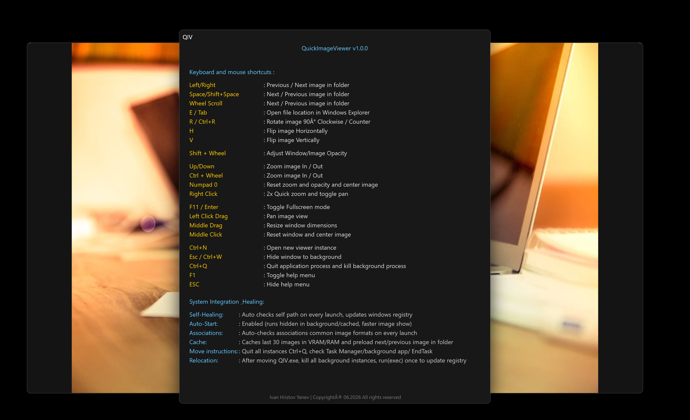

# QuickImageViewer (QIV)

**A fast, GPU-accelerated image viewer for Windows.**  
Built on Direct2D, WIC, and native Win32 APIs. Single EXE, no installer, no telemetry, ~7 MB.

---

## Preview

| Main Interface | Shortcuts Reference |
|:---|:---|
|  |  |

---

## Download

**[→ Latest Release](https://github.com/icyhoty2k/QuickImageViewer/releases/latest)**

---

## Format Support

| Format | Extensions | Decoder | Notes |
|:---|:---|:---|:---|
| JPEG | `.jpg` `.jpeg` | WIC | Full EXIF / GPS metadata |
| PNG | `.png` | WIC | 16-bit, alpha |
| BMP | `.bmp` | WIC | |
| TIFF | `.tif` `.tiff` | WIC | Multi-page (first frame) |
| GIF | `.gif` | WIC | Static (first frame) |
| WebP | `.webp` | WIC | Windows 10+ native codec |
| HEIF / HEIC | `.heif` `.heic` | WIC | Requires MS HEIF Extensions |
| AVIF | `.avif` | WIC | Windows 11 native codec |
| JPEG XL | `.jxl` | WIC | Windows 11 24H2+ native codec |
| JPEG 2000 | `.jp2` `.j2k` | OpenJPEG | Static lib |
| SVG | `.svg` | resvg | Rust static lib, async IO thread |
| OpenEXR | `.exr` | tinyexr | Reinhard tone-map + γ2.2 |
| Radiance HDR | `.hdr` | Inline | RGBE adaptive RLE, Reinhard tone-map |
| PNM | `.ppm` `.pgm` `.pbm` | Inline | P1–P6, up to 16-bit maxval |
| QOI | `.qoi` | Inline | Lossless fast format |
| ICO | `.ico` `.cur` | WIC | |

**WIC** = Windows Imaging Component (OS native, zero dependency)  
**Inline** = implemented directly with no third-party library

---

## Features

### Performance
- **GPU bitmap cache** — decoded images live in VRAM, preloaded in both directions
- **Background decode** — worker thread pool; UI thread never blocks on IO
- **Instant startup** — process stays resident in RAM after first launch (hide to tray with `Esc`, recall instantly)
- **Software fallback** — GDI renderer for edge cases where Direct2D is unavailable

### Navigation
- Next / prev with `→` `←` or scroll wheel
- Sort by name, date modified, file size, extension, or physical disk order
- Toggle between first and last image in folder (`Backspace`)
- Toggle between current and previous folder (`Q`)
- Full folder history with favorites, sorted by visit frequency
- Drag & drop, CLI argument, registered file handler
- Multi-instance aware — multiple windows supported

### UI Panels

| Panel | Shortcut | Description |
|:---|:---|:---|
| EXIF / Info | `M` | Full metadata: camera, capture settings, GPS with offline geocoding |
| Directory | `F5` / `F6` | All images in current folder; syncs selection with viewer |
| Cache | `F3` / `F4` | Live GPU cache occupancy, thumbnails of preloaded images |
| History | `Tab` | Recent folders with favorites; Shift+Enter opens in DirWnd |
| Help | `F1` | Full keyboard shortcut reference |

### Offline Reverse Geocoding
GPS coordinates in EXIF are resolved to full location data with **zero network calls**. All data is compressed (zlib) and embedded directly in the EXE.

| Data | Source | Entries | Shows |
|:---|:---|:---|:---|
| Cities | GeoNames cities1000 | 170,387 | City name, timezone |
| Admin1 | admin1CodesASCII | 3,865 | State / Province |
| Admin2 | admin2Codes | 47,549 | District / County |
| Country | countryInfo | 252 | Country, Capital, Continent, Currency, Phone prefix |

Example output in the EXIF panel for a photo taken in Paris:
```
City        Paris
District    Paris
State       Ile-de-France
Country     France
Continent   Europe
Capital     Paris
Currency    EUR (Euro)
Phone       +33
Timezone    Europe/Paris
```

### Color Effects
All effects are non-destructive and GPU-accelerated via the Direct2D effect graph. `Ctrl+S` saves the result to disk.

| Effect | Key |
|:---|:---|
| Grayscale | `Del` |
| Invert | `Ins` |
| Sepia | `Home` |
| Solarize | `End` |
| Outline | `PgUp` |
| Threshold | `PgDn` |
| Brightness ± | `\` / `'` |
| Contrast ± | `/` / `.` |
| Saturation ± | `[` / `]` |
| Gamma ± | `=` / `-` |
| Toggle all effects | `` ` `` |
| Reset all | `Num0` |

### Overlay System
9 independently configurable data slots rendered on the image canvas. Each slot shows contextual info (filename, index, zoom, dimensions, file size, effects state) and can be toggled, repositioned, or set to compact mode individually.

```
[Ctrl+1] Top Left    [Ctrl+2] Top Center    [Ctrl+3] Top Right
[Ctrl+4] Mid Left    [Ctrl+5] Center        [Ctrl+6] Mid Right
[Ctrl+7] Bot Left    [Ctrl+8] Bot Center    [Ctrl+9] Bot Right
```

Master toggle: `N` or `I` — Layout cycle: `O` — Background: `P` — Compact per slot: `Ctrl+Alt+1–9`

### Transform
- Rotate view: `R`
- Flip horizontal: `H`  
- Flip vertical: `V`
- Copy to clipboard: `Ctrl+C`
- All transforms are non-destructive (view only)

### Window & Chrome
- Fullscreen: `F11` / `F` / `Enter`
- Always on top: `Ctrl+T`
- Move window: `Shift+WASD`
- Snap to screen zones: `Alt+WASD` and `Alt+Q/E/Z/C`
- Opacity: `Shift+Wheel`
- Resize: `MMB drag`
- Round / square corners toggle: `Num*`
- Backdrop type cycle: `Num/`
- Runtime theme factor: `Ctrl+Alt+Num+/-`

### Mouse Shortcuts

| Input | Action |
|:---|:---|
| Wheel | Previous / next image |
| Ctrl+Wheel | Zoom in / out |
| Shift+Wheel | Adjust opacity |
| LMB hold | Quick zoom 3× centered on cursor |
| LMB drag (zoomed) | Pan; reverts on release |
| RMB hold / drag | Move window |
| RMB + LMB | Reveal current file in Explorer |
| MMB click | Reset zoom / pan / opacity, center window |
| MMB drag | Live-resize window from top-left |
| Double-click | Toggle fullscreen |

---

## Architecture

- **Renderer** — Direct2D + D3D11 with GPU bitmap cache. GDI software fallback. Full ID2D1Effect graph for color operations.
- **Decoding** — WIC pipeline for OS-native formats. Custom decoders (SimpleFormats.cpp) for EXR, HDR, PNM, QOI. SVG via resvg on a background IO thread.
- **Threading** — Worker thread pool for background decode and preload. Atomic `wantedIndex` prevents stale frames. `WM_QIV_REPAINT` / `WM_QIV_SVG_READY` messages synchronize back to the UI thread.
- **Caching** — GPU bitmap cache with configurable size. Preloads adjacent images in both directions. Live cache inspector panel.
- **DPI** — Per-monitor DPI aware V2. All layout scales via `MulDiv(GetDpiForWindow(...))`.
- **Persistence** — Registry-backed settings. Folder history manager. Favorites system.

### Third-Party Libraries

| Library | Purpose |
|:---|:---|
| [resvg](https://github.com/RazrFalcon/resvg) | SVG rasterizer (Rust static lib) |
| [OpenJPEG](https://github.com/uclouvain/openjpeg) | JPEG 2000 decoder |
| [tinyexr](https://github.com/syoyo/tinyexr) | OpenEXR decoder |
| [miniz](https://github.com/richgel999/miniz) | zlib compression for embedded GeoNames data |

---

## Build

Requires CMake and MSVC (Visual Studio 2022 or CLion).

```bash
git clone https://github.com/icyhoty2k/QuickImageViewer.git
cd QuickImageViewer
mkdir build && cd build
cmake .. -DCMAKE_BUILD_TYPE=Release
cmake --build . --config Release
```

For offline geocoding, generate the GeoNames binary resources before building:
```bash
# Download cities1000.txt, admin1CodesASCII.txt, admin2Codes.txt, countryInfo.txt
# from geonames.org and place them in resources/geoData/
python tools/preprocess_cities.py
```

---

## License

Licensed under the **[GNU Affero General Public License v3.0 (AGPLv3)](docs/LICENSE)**.
