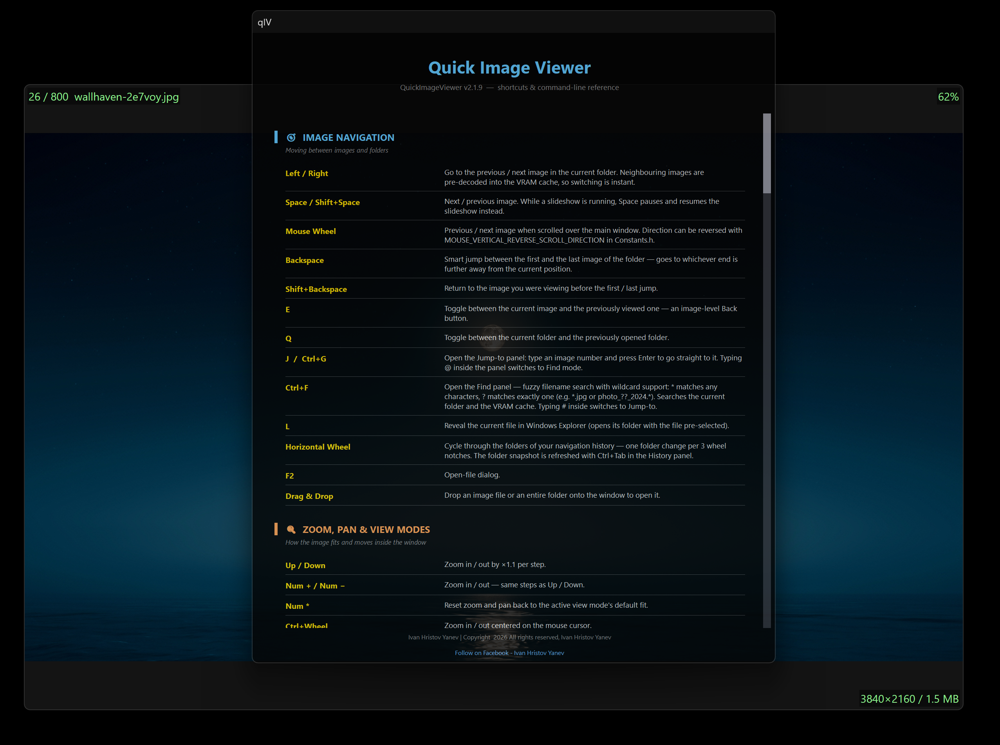
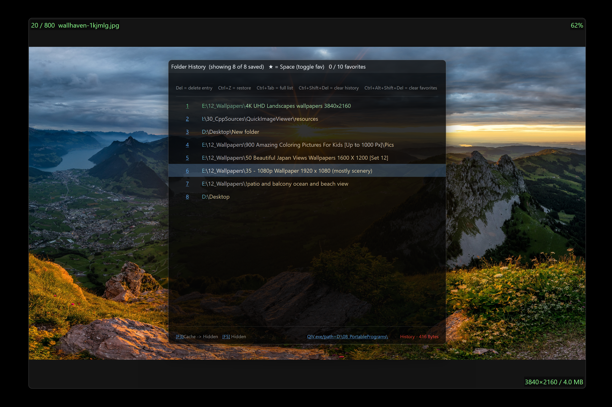
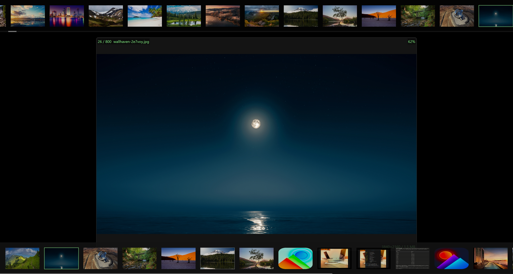
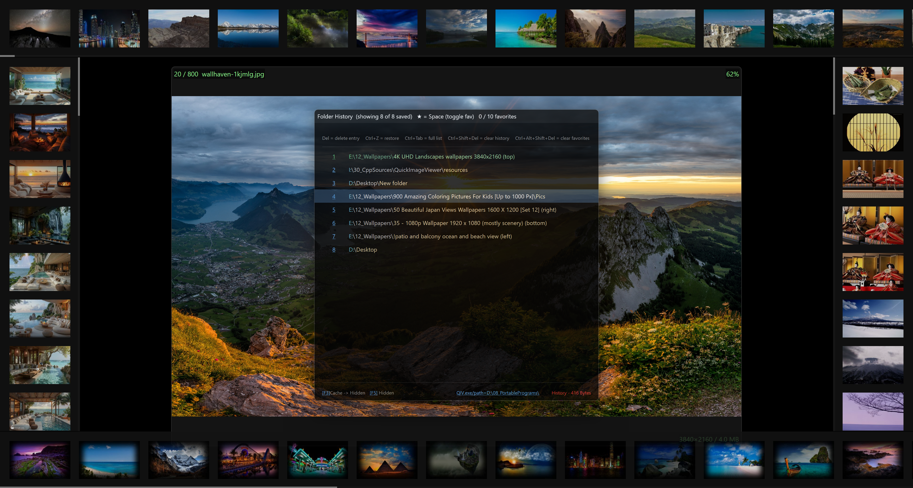
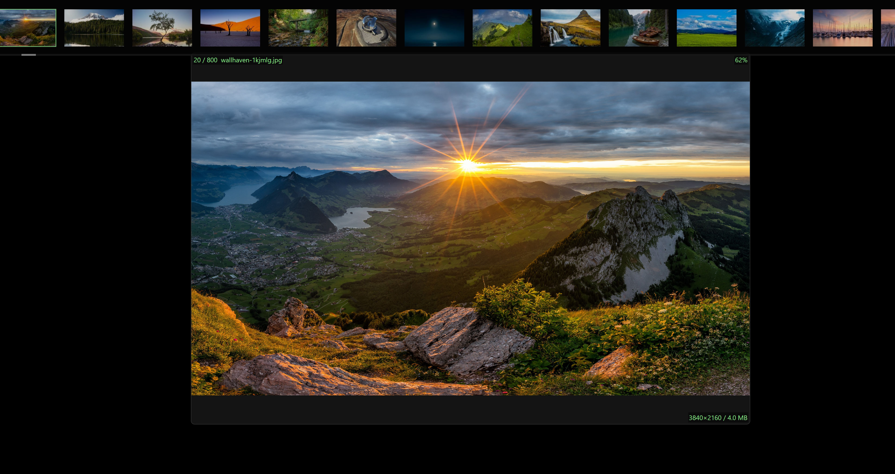
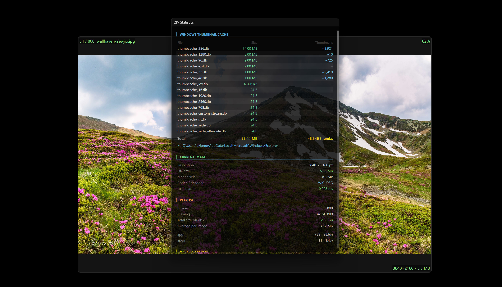
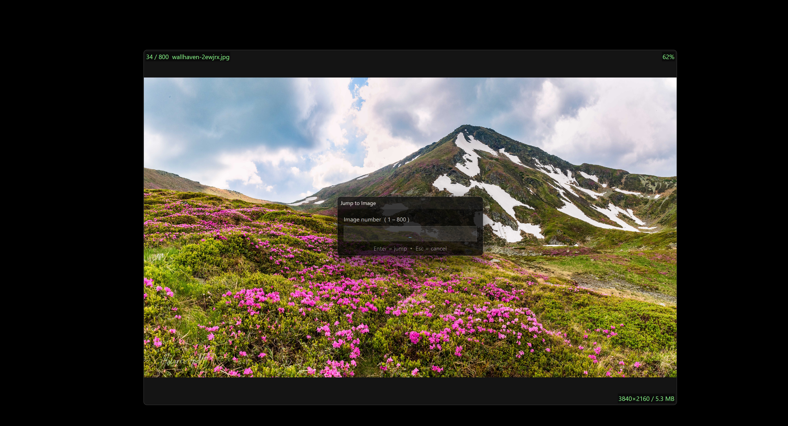

# QuickImageViewer (qIV)

**A fast, GPU-accelerated image viewer for Windows.**  
Built on Direct2D, WIC, and native Win32 APIs. Single EXE, no installer(portable), no telemetry, sub-10 MB .


---

## Preview

| | |
|:---:|:---:|
| <br>**Main interface** — thumbnail strips and info overlays | <br>**Help window** (F1) — full shortcut reference |
| <br>**Folder History** panel with favorites | <br>**EXIF / Image Info** panel — offline GPS geocoding |
| <br>**Dual thumbnail strips** — VRAM cache (top) and current directory (bottom) | <br>**Four floating directory strips** around the viewer + History panel |
| <br>**Directory strip** — browsing a 4K wallpaper folder | <br>**Statistics panel** — codec, cache and playlist info |
| <br>**Jump-to** dialog — go straight to any image number | <br>**Find** dialog — filename search with `*` and `?` wildcards |
---

## Download

**[→ Latest Release](https://github.com/icyhoty2k/QuickImageViewer/releases/latest)**

---

## Format Support

| Format | Extensions | Decoder | Notes |
|:---|:---|:---|:---|
| JPEG | `.jpg` `.jpeg` | WIC | Full EXIF / GPS metadata |
| PNG | `.png` | WIC | 16-bit, alpha |
| BMP | `.bmp` | WIC | |
| TIFF | `.tif` `.tiff` | WIC | Multi-page (first frame) |
| GIF | `.gif` | WIC | Static (first frame) |
| WebP | `.webp` | WIC | Windows 10+ native codec |
| HEIF / HEIC | `.heif` `.heic` | WIC | Requires MS HEIF Extensions |
| AVIF | `.avif` | WIC | Windows 11 native codec |
| JPEG XL | `.jxl` | WIC | Windows 11 24H2+ native codec |
| JPEG 2000 | `.jp2` `.j2k` | OpenJPEG | Static lib |
| SVG | `.svg` | resvg | Rust static lib, async IO thread |
| OpenEXR | `.exr` | tinyexr | Reinhard tone-map + γ2.2 |
| Radiance HDR | `.hdr` | Inline | RGBE adaptive RLE, Reinhard tone-map |
| PNM | `.ppm` `.pgm` `.pbm` | Inline | P1–P6, up to 16-bit maxval |
| QOI | `.qoi` | Inline | Lossless fast format |
| ICO | `.ico` `.cur` | WIC | |

**WIC** = Windows Imaging Component (OS native, zero dependency)  
**Inline** = implemented directly with no third-party library

---

## How qIV Compares

| Feature | qIV | Windows Photos | IrfanView |
|:---|:---:|:---:|:---:|
| GPU VRAM bitmap cache | ✅ Direct2D | ❌ | ❌ |
| Instant image switching | ✅ pre-decoded neighbours | ⚠️ visible load delay | ⚠️ visible load delay |
| HEIC / AVIF / JPEG XL | ✅ native + codec | ✅ | ⚠️ plugin required |
| SVG / OpenEXR / HDR | ✅ built-in | ❌ | ⚠️ plugin required |
| Offline GPS geocoding | ✅ embedded, zero network | ❌ | ❌ |
| Floating thumbnail panels | ✅ up to 6 simultaneous | ❌ | ❌ |
| Per-monitor DPI V2 | ✅ | ✅ | ⚠️ partial |
| Portable — no installer | ✅  MB single EXE | ❌ UWP / Store | ✅ |
| No telemetry / tracking | ✅ zero | ❌ Microsoft telemetry | ✅ |
| No ads | ✅ | ❌ promoted content | ✅ |
| No background services | ✅ process exits cleanly | ❌ always-on UWP runtime | ✅ |
| Open source | ✅ AGPLv3 | ❌ | ❌ |
| Kiosk / locked display mode | ✅ CLI flag | ❌ | ⚠️ limited |

---

## Features

### Performance
- **GPU bitmap cache** — decoded images live in VRAM, preloaded in both directions
- **Background decode** — worker thread pool; UI thread never blocks on IO
- **Instant startup** — process stays resident in RAM after first launch (hide to tray with `Esc`, recall instantly)
- **Software fallback** — GDI renderer for edge cases where Direct2D is unavailable

### Navigation

| Shortcut | Action |
|:---|:---|
| `→` / `←` or Wheel | Next / previous image |
| `Space` / `Shift+Space` | Next / previous image |
| `Backspace` | Smart jump between first and last image (goes to whichever is further) |
| `Shift+Backspace` | Return to image before the first/last jump |
| `E` | Toggle between current and previously viewed image |
| `Q` | Toggle between current and previously opened folder |
| `J` / `Ctrl+G` | Jump to image by number (type `@` to switch to Find mode) |
| `Ctrl+F` | Find by filename — wildcard support (`*`, `?`); type `#` to switch to Jump mode |
| `L` | Reveal current file in Windows Explorer |
| Horizontal Wheel | Cycle through navigation history folders (one change per 3 notches) |
| `F2` | Open-file dialog |
| Drag & Drop | Drop a file or folder onto the window |

### Sorting

| Shortcut | Order |
|:---|:---|
| `Ctrl+Alt+Shift+0` | By name (natural / Explorer order) — press again to reverse |
| `Ctrl+Alt+Shift+9` | By date modified — press again to flip newest ↔ oldest |
| `Ctrl+Alt+Shift+8` | By file size — press again to flip largest ↔ smallest |
| `Ctrl+Alt+Shift+` | By extension — press again to reverse |
| `Ctrl+Alt+Shift+6` | By physical disk order (fastest for HDDs) |

### UI Panels

| Panel | Shortcut | Description |
|:---|:---|:---|
| Help | `F1` | Full shortcut & CLI reference — 2-column, double-buffered, DPI-aware. `Ctrl+E` exports to Desktop as UTF-8 text. |
| EXIF / Info | `M` | Full metadata: camera, exposure, GPS with offline geocoding, embedded preview thumbnail |
| Statistics | `K` | Decode time, codec, file details and cache info for the current image |
| Directory | `F6` / `F`  *(or Right Shift)* | All images in current folder; syncs selection with viewer / moves panel to next screen edge |
| Cache | `F3` / `F4` | Live GPU cache occupancy, thumbnails of preloaded images / moves panel |
| Reload | `F5` | Refresh / reload the current directory from disk |
| History | `Tab` | Recent folders with favorites — `Shift+Enter` spawns a DirWnd without leaving current folder |

### Offline Reverse Geocoding
GPS coordinates in EXIF are resolved to full location data with **zero network calls**. All data is compressed (zlib) and embedded directly in the EXE.

| Data | Source | Entries | Shows |
|:---|:---|:---|:---|
| Cities | GeoNames cities1000 | 10,38 | City name, timezone |
| Admin1 | admin1CodesASCII | 3,865 | State / Province |
| Admin2 | admin2Codes | 4,549 | District / County |
| Country | countryInfo | 252 | Country, Capital, Continent, Currency, Phone prefix |

Example output in the EXIF panel for a photo taken in Paris:
```
City        Paris
District    Paris
State       Ile-de-France
Country     France
Continent   Europe
Capital     Paris
Currency    EUR (Euro)
Phone       +33
Timezone    Europe/Paris
```

### Thumbnail Strips
All thumbnail panels (Cache, Directory, and spawned DirWnds) share the same behaviour:

- **Scroll** — mouse wheel; hold Shift for 3× speed
- **Wrap-around** — `B` toggles wheel wrap: scrolling past the last thumbnail jumps to the first (and vice-versa). A center overlay message confirms each wrap. Startup default is controlled by `THUMBNAIL_PANEL_WHEEL_WRAP_AROUND` in `Constants.h`.
- **Open** — left-click any thumbnail to open it in the main viewer
- **Drag** — click and drag the strip to scroll freely
- **Scrollbar** — thin bar on the inner edge; click-drag for quick scrubbing
- **Spawn DirWnd** — from the History panel, `Shift+Enter` or **MMB click** on an entry opens a floating directory strip for that folder without leaving the current one (up to 4 simultaneous strips, pre-allocated and reused for instant spawning). If a strip is already open for that folder, the same gesture hides it instead (toggle)
- **Active strip** — clicking any directory strip makes it the *active* panel; all subsequent folder navigation (History `Enter`, folder changes) targets that strip. The primary `F6` strip is the fallback when no spawned panel has been clicked
- **Close with MMB** — middle-mouse-button click on any directory strip or floating panel (Help, EXIF, Stats, Jump-to, Find) closes it immediately

### File Management on Thumbnail Strips
Directory strips double as a lightweight file manager:

- **Drag & drop between strips** — drag a thumbnail from one directory strip and drop it on another to **move** the file. Hold `Ctrl` while dropping to **copy** instead; the mouse cursor shows which operation is active. Both panels refresh automatically and every operation goes through the Recycle-Bin-aware Windows shell (undo with `Ctrl+Z` in Explorer).
- **Right-click context menu** — Copy, Cut, Delete and Paste on any thumbnail:
  - **Copy / Cut** — puts the file on the Windows clipboard (works with Explorer too). A cut file is shown dimmed until pasted.
  - **Paste** — drops clipboard files into the strip's folder; both source and destination strips refresh instantly.
  - **Delete** — sends the file to the Recycle Bin.

### History Panel

| Shortcut | Action |
|:---|:---|
| `Tab` | Toggle History panel |
| `Ctrl+Tab` | Toggle full (uncapped) view and refresh the folder snapshot |
| `Enter` | Open hovered folder in main viewer |
| `Shift+Enter` | Spawn / hide a floating DirWnd for the hovered folder (toggle) |
| `MMB click` on a row | Spawn / hide a floating DirWnd for the hovered folder (panel stays open) |
| `Space` | Toggle favorite on hovered entry |
| `Delete` | Delete hovered entry (`Ctrl+Z` restores last deleted) |
| `Ctrl+Shift+Delete` | Clear all history, keep favorites |
| `Ctrl+Alt+Shift+Delete` | Clear all favorites, keep history |

### Slideshow

| Shortcut | Action |
|:---|:---|
| `Ctrl+F1` | Start / stop slideshow |
| `Space` *(while running)* | Pause / resume |
| `R` *(while running)* | Toggle loop |
| `S` *(while running)* | Toggle shuffle |
| `T` *(while running)* | Step to the next transition (21 available, wraps) |

### Color Effects
All effects are non-destructive and GPU-accelerated via the Direct2D effect graph. `Ctrl+S` saves the result to disk.

| Effect | Key |
|:---|:---|
| Rotate CW / CCW | `R` / `Shift+R` |
| Flip horizontal / vertical | `H` / `V` |
| Grayscale | `Delete` |
| Invert | `Insert` |
| Sepia | `Home` |
| Solarize (>50% brightness inverted) | `End` |
| Outline (GPU edge detection) | `Page Up` |
| Threshold (black & white at 50%) | `Page Down` |
| Brightness ± | `\` / `'` |
| Contrast ± | `/` / `.` |
| Saturation ± | `[` / `]` |
| Gamma ± | `=` / `-` |
| Toggle all effects (bypass) | `` ` `` |
| Reset all effects | `Num 0` |
| Save with effects baked in | `Ctrl+S` |

### Overlay System
9 independently configurable data slots rendered on the image canvas.

```
[Ctrl+1] Top Left    [Ctrl+2] Top Center    [Ctrl+3] Top Right
[Ctrl+4] Mid Left    [Ctrl+5] Center        [Ctrl+6] Mid Right
[Ctrl+] Bot Left    [Ctrl+8] Bot Center    [Ctrl+9] Bot Right
```

| Shortcut | Action |
|:---|:---|
| `N` / `I` / `Ctrl+0` | Master toggle — show / hide all slots |
| `Ctrl+1` – `Ctrl+9` | Toggle individual slots |
| `Ctrl+Shift+1` – `Ctrl+Shift+9` | Toggle compact mode per slot (1 line instead of 2) |
| `O` | Cycle overlay layout: Grid → Stacked → Summary |
| `P` | Toggle semi-transparent background behind overlay text |

### Window & Chrome

| Shortcut | Action |
|:---|:---|
| `F` / `F11` / `Enter` / `Ctrl+Shift+T` | Toggle borderless fullscreen |
| `Ctrl+T` / `Ctrl+A` | Toggle always-on-top |
| `Shift+W/A/S/D` | Nudge window 20 px up / left / down / right |
| `Alt+W/A/S/D` | Snap to top / left / bottom / right half of work area |
| `Alt+Q/E/Z/C` | Snap to top-left / top-right / bottom-left / bottom-right quarter |
| `Alt+X` | Reset window size, position and all effects |
| `Shift+Num+/-` / `Shift+=/−` | Grow / shrink window by 20 px per side |
| Drag near screen edge | Snap to that edge (within 24 px) |
| `Ctrl+Space` | Toggle: fit viewer to work area (avoiding visible panels) ↔ restore default size centered on monitor |
| `Ctrl+Alt+Num+/-` | Step all panel colors lighter / darker at runtime |
| `Ctrl+Alt+Num 0` | Reset theme brightness to compiled default |
| `Ctrl+Shift+Num *` | Toggle window corners: rounded ↔ square |
| `Ctrl+Shift+Num /` | Cycle backdrop material: None → Mica → Acrylic → MicaAlt |

### Mouse Shortcuts

| Input | Action |
|:---|:---|
| Wheel | Previous / next image |
| Ctrl+Wheel | Zoom in / out centered on cursor |
| Shift+Wheel | Adjust window opacity in 10% steps |
| Horizontal Wheel | Cycle navigation history folders |
| LMB hold | Quick zoom 3× centered on cursor |
| LMB drag *(while zoomed)* | Pan; reverts on release |
| LMB double-click | Toggle fullscreen |
| RMB drag | Move window |
| RMB + LMB | Reveal current file in Explorer |
| RMB + Wheel | Zoom in / out |
| RMB + Horizontal Wheel | Live-resize window from center (20 px per notch) |
| MMB click | Full visual reset: zoom, pan, opacity; center and resize window |
| MMB drag | Live-resize window from top-left |

> Button roles assume `SWAP_MOUSE_BUTTONS = true` in `Constants.h` (default). Set to `false` to exchange left and right button functions.

---

## System Tray

When QIV is hidden or running in the background, its icon appears in the system tray. All persistent settings are accessible from the right-click context menu — no config files to edit.

**Tray icon actions:**

| Action | Result |
|:---|:---|
| Double-click | Restore the main window to the foreground |
| Right-click | Open the context menu |

**Context menu top-level items:**

| Item | Action |
|:---|:---|
| Restore QuickImageViewer | Show and focus the main window |
| Help / Shortcuts | Open the in-app help window |
| Exit Completely | Remove the tray icon and fully quit the process |

### Settings submenu

All toggles save immediately and are reflected live.

**Boolean toggles (checkmarks):**

| Setting | Effect |
|:---|:---|
| Keep in Background | Esc / Ctrl+W hides to tray instead of exiting; process stays resident for instant re-open |
| Run on Startup | Write / remove a Windows startup registry entry (`HKCU\…\Run`). Dedicated instances use a separate entry |
| Thumbnail Effects | Master switch for glow borders, rounded corners and hover-scale on thumbnail strips |
| History: Open Full List | Tab opens the full uncapped history view when enabled |
| Info Overlays | Show / hide all nine overlay text slots |
| Open Thumbnail Strip on Start | Auto-open the directory strip on every launch |
| Overlay Background | Semi-transparent background panel behind overlay text |
| Swap Mouse Buttons | Exchange left/right button roles: hold-to-zoom ↔ drag-to-move-window |
| Invert Scroll Direction | Reverse vertical wheel for image navigation |
| Invert Horizontal Scroll | Reverse horizontal wheel for folder history navigation |
| Start in Fullscreen | Open fullscreen on every launch |

**Numeric settings** (click any label to open an input dialog; current value is shown in the label):

| Setting | Range | Effect |
|:---|:---|:---|
| VRAM Cache Size | 0 – 999 | Images to keep decoded in GPU memory |
| Window Width / Height | 240 – 16000 px | Default dimensions used by Ctrl+Space and window reset |
| History Max Dirs / Favs | 0 – 999 | Items shown in the History panel |
| Dir Thumb Cache | 100 – 64000 MB | Memory budget for directory thumbnail bitmaps |
| Preload Lookaside | 1 – 99 | Images to pre-decode ahead and behind the current one |
| Overlay Message Duration | 250 – 10000 ms | How long center overlay messages stay visible |
| History Save Limit | 1 – 99999 | Folders persisted to disk between sessions |

**Settings file operations:**

| Item | Effect |
|:---|:---|
| Export Settings | Save all settings to a UTF-8 `.ini` file (default filename includes today's date) |
| Import Settings | Load a previously exported `.ini` file — confirmation required; all settings applied immediately |
| Restore Defaults | Reset every setting to its compiled-in default — confirmation required; history and favorites are not affected |

### View Mode submenu
Pick the default fit mode (radio buttons): **1** Fit to view (aspect) · **2** Fit to width · **3** Fit to height · **4** Stretch to window · **5** Original size.

### Slideshow submenu
Set default interval (100 – 60000 ms), toggle Loop and Shuffle, and choose the default transition type (Cut / Fade / Dissolve / Ripple / Push / Zoom). All changes persist.

### Sort submenu
Choose sort order: **Name** / **Date Modified** / **Size** / **Type** / **Disk Order**, plus a **Reverse Order** toggle. Takes effect immediately on the current folder.

### Backup submenu

| Item | Effect |
|:---|:---|
| Backup History & Favorites | Export history and favorites to a `.zip` archive (file-save dialog) |
| Restore History & Favorites | Restore from a previously created backup — confirmation required |

### Dedicated Screens

Press `F8` for the Dedicated panel. A **dedicated screen** is a separate copy of qIV with its own settings file beside it — normally parked fullscreen on one monitor running a slideshow. Any number can run at once, alongside the main app, sharing nothing.

**How a copy is identified.** Everything derives from the executable's own path:

```
D:\Screens\qIV_dedicated_Lobby.exe        the copy
D:\Screens\qIV_dedicated_Lobby.ini        its settings
D:\Screens\imageLists_qIV_dedicated_Lobby.qim     image folders
D:\Screens\promotionList_qIV_dedicated_Lobby.qpr  promotion folders
```

Two files cannot share a name in one folder, so two screens can never resolve to the same settings, mutex or window class.

**Startup decision**, made from the filesystem before any setting is read:

| Condition | Result |
|:---|:---|
| An `.ini` sits beside the exe | Settings come from it; the registry is never touched |
| Exe name contains `dedicated`, no `.ini` | A default `.ini` is generated and the F8 panel opens |
| Neither | Normal registry-backed launch |

Inside the `.ini`, `[Instance]Dedicated` decides behaviour — `1`/`true`/`on`/`yes` or any non-zero number. Set it to `0` and you get a **portable** ordinary viewer: settings in a file, history and favorites intact, nothing in the registry.

**Panel buttons**

| Button | Action |
|:---|:---|
| Generate App | Copy this executable to a chosen folder as `qIV_dedicated_<name>.exe` |
| Generate Config | Write that copy's `.ini`, holding every setting shown in the panel |
| Add Images / Add Promotions | Append a folder to the `.qim` / `.qpr` list — duplicates reported and skipped |
| Add Startup / Remove Startup | Create or delete a `shell:startup` shortcut pointing at the copy |
| Test Config / Test Images / Test Promos | Check one thing at a time |

The panel edits the **config only** — it never changes the app you are using, and every value starts from the compiled defaults rather than your current settings, so a screen never inherits the authoring machine's preferences.

`Test Images` / `Test Promos` count the images actually found per folder and flag folders that are missing or empty. A folder that exists but holds nothing decodable looks identical to a working one until the screen goes blank.

**Kiosk lock.** Tick **Kiosk lock** in the panel and the screen ignores every key and every click — nobody walking past can pause the slideshow or open a panel. The tray icon keeps working (its menu runs its own message loop, so the locked window never sees those messages), and **Settings › Kiosk Lock** there is the only way back in. The main app has the same toggle in its tray menu, and `-lock` forces it on for a single launch without changing the stored setting.

**Always on top.** Keeps the screen above every other window so nothing that pops up can cover it. `Ctrl+T` toggles it live and the setting persists; the panel sets it for a generated screen.

**Keep display awake.** Blocks the screensaver and display sleep while the window is on screen. Leave it off and Windows eventually blanks the display with nobody there to wake it — and with the kiosk lock on, nobody could. The hold is released automatically when the window hides to the tray, so a viewer sitting in the tray never keeps a machine up.

**Isolation.** A dedicated screen writes *nothing* to the registry, keeps no history or favorites, and has its own mutex and window class — so a file opened from Explorer can never land on a slideshow instead of the main window. It auto-starts from a shortcut rather than the `Run` key.

### Promotions

A dedicated screen can interleave a **second playlist** with its images — never merged into them, and invisible to the image counter and arrow keys.

| Setting | Meaning |
|:---|:---|
| Pick | `Sequential` (folder order) or `Weighted by priority` |
| Priority | From a `#N` suffix on the filename — `sale#500.jpg` is 500× likelier than a file with no suffix. Range 1–65535 |
| Every N images | Gap counted in pictures |
| Every N seconds | Gap counted in wall-clock time |
| Shown for | Promotion dwell time, independent of the slide interval |

Both triggers are `(from, to)` pairs and run **independently** — set either, or both, and whichever comes due first shows a promotion:

- `(0, 0)` — off
- `(5, 0)` — exactly every 5
- `(5, 15)` — re-rolled between 5 and 15 each time, so it never looks mechanical

---

## Command-Line Arguments

```
QuickImageViewer.exe [image_path] [options]
```

| Argument | Description |
|:---|:---|
| `"path\to\image.jpg"` | Open this image at startup and browse its folder |
| `-startFolder <path>` | Open this folder as the browse / slideshow source |
| `-background` | Start hidden in the system tray (service mode) |
| `-fullscreen` | Start in fullscreen |
| `-windowedView` | Start windowed (explicit override) |
| `-alwaysOnTop` | Keep window above all others from launch |
| `-monitorNum#N` | Open centered on monitor N (1-based, e.g. `-monitorNum#2`) |
| `-slideshow` | Auto-start slideshow after content loads |
| `-slideshowInterval N` | Seconds between slides (e.g. `-slideshowInterval 8`) |
| `-repeat` | Loop the slideshow when it reaches the end |
| `-shuffle` | Play slideshow in random order |
| `-slideshowTransition=<type>` | Transition by name — 21 available (`Fade`, `Iris`, `SlideLeft`, `ZoomIn`, `Spin`, …) |
| `-slideshowTransitions=<list>` | Custom set, by name or by the numbers shown in the menu (`Fade,Iris,Spin` or `6,8,1`) |
| `-slideshowTransitionSource=<none\|all\|list>` | Which transitions are in play |
| `-slideshowTransitionOrder=<sequential\|random>` | How the next one is drawn from that set |
| `-slideshowTransitionShuffle` | Legacy shorthand for `source=all order=random` |
| `-hideMouse` | Hide the mouse cursor at startup |
| `-lock` | KIOSK mode — all keyboard and mouse input is ignored; unlock from the tray |
| `-keepDisplayAwake` | Block the screensaver and display sleep while the window is on screen |
| `-dedicated` | Run as a dedicated screen — no registry writes, no history, own icon, mutex and window class |
| `-config <path>` | Use this `.ini` instead of the one named after the exe |
| `-instance=<name>` | Name this instance — settings, lists, mutex and window class derive from it |
| `-instanceDesc=<text>` | Free-text description, shown on the generated shortcut |
| `-promoOrder=<sequential\|weighted>` | How the next promotion is chosen |
| `-promoEveryImages=<from>-<to>` | Promotion every N images — `0` off, `5-0` exact, `5-15` random |
| `-promoEverySeconds=<from>-<to>` | Same, counted in seconds — independent of the image counter |
| `-RestoreDefaults` | Wipe all saved settings from the registry, show a confirmation dialog, and exit — recovery fallback if the app misbehaves after a config change |
| `-runOnStartup` | Write / refresh the Windows startup registry entry so QIV launches automatically with Windows. Equivalent to "Run on startup" in the tray menu. Dedicated instances write their own separate entry |

**Kiosk example:**
```
QuickImageViewer.exe -dedicated -lock -fullscreen -slideshow -shuffle -slideshowInterval 8 -startFolder "D:\Ads"
```

**Dedicated screen** — the form the F8 panel writes into a startup shortcut. Folders and every setting come from the `.ini` and its `.qim` / `.qpr` lists:
```
qIV_dedicated_Lobby.exe -dedicated -config "D:\Screens\qIV_dedicated_Lobby.ini"
```

---

## Architecture

- **Renderer** — Direct2D + D3D11 with GPU bitmap cache. GDI software fallback. Full ID2D1Effect graph for color operations.
- **Decoding** — WIC pipeline for OS-native formats. Custom decoders (SimpleFormats.cpp) for EXR, HDR, PNM, QOI. SVG via resvg on a background IO thread.
- **Threading** — Worker thread pool for background decode and preload. Atomic `wantedIndex` prevents stale frames. `WM_QIV_REPAINT` / `WM_QIV_SVG_READY` messages synchronize back to the UI thread. A dedicated async write queue (`WriteQueue`) coalesces registry writes (last value per key wins — rapid slider changes cost one write) and serializes file I/O tasks on a single sleeping drain thread.
- **Caching** — GPU bitmap cache with configurable size. Preloads adjacent images in both directions. Live cache inspector panel.
- **DPI** — Per-monitor DPI aware V2. All layout scales via `MulDiv(GetDpiForWindow(...))`.
- **Persistence** — Registry-backed settings with batched read at startup (one `RegOpenKeyEx` + N `RegQueryValueEx` + `RegCloseKey`). Folder history manager. Favorites system. All writes are async via `WriteQueue` and flushed before process exit.

### Third-Party Libraries

| Library | Purpose |
|:---|:---|
| [resvg](https://github.com/RazrFalcon/resvg) | SVG rasterizer (Rust static lib) |
| [OpenJPEG](https://github.com/uclouvain/openjpeg) | JPEG 2000 decoder |
| [tinyexr](https://github.com/syoyo/tinyexr) | OpenEXR decoder |
| [miniz](https://github.com/richgel999/miniz) | zlib compression for embedded GeoNames data |

---

## Build

Requires CMake and MSVC (Visual Studio 2022 or CLion).

```bash
git clone https://github.com/icyhoty2k/QuickImageViewer.git
cd QuickImageViewer
mkdir build && cd build
cmake .. -DCMAKE_BUILD_TYPE=Release
cmake --build . --config Release
```

For offline geocoding, generate the GeoNames binary resources before building:
```bash
# Download cities1000.txt, admin1CodesASCII.txt, admin2Codes.txt, countryInfo.txt
# from geonames.org and place them in resources/geoData/
python tools/preprocess_cities.py
```

---

## License

Licensed under the **[GNU Affero General Public License v3.0 (AGPLv3)](docs/LICENSE)**.
