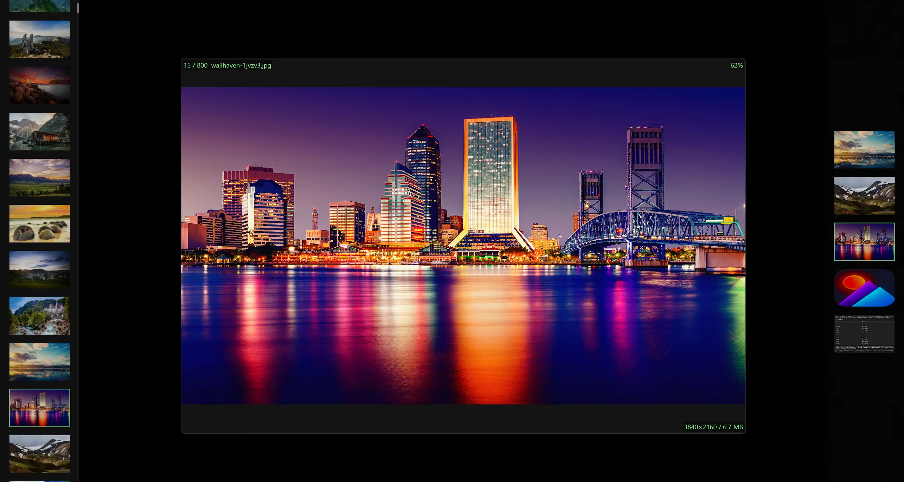
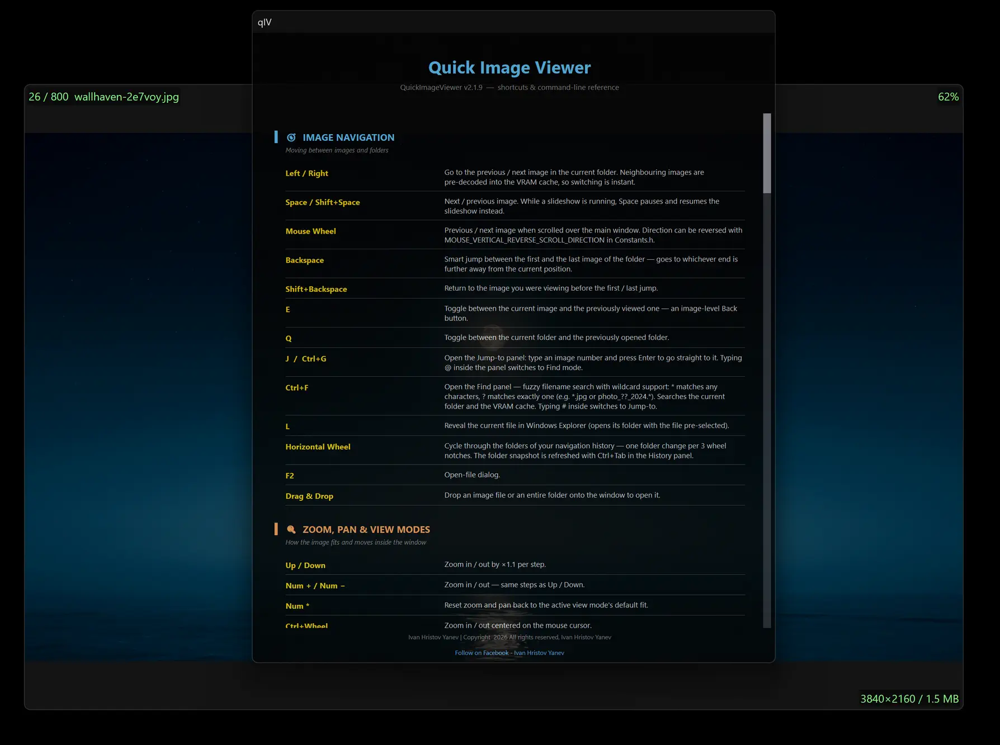
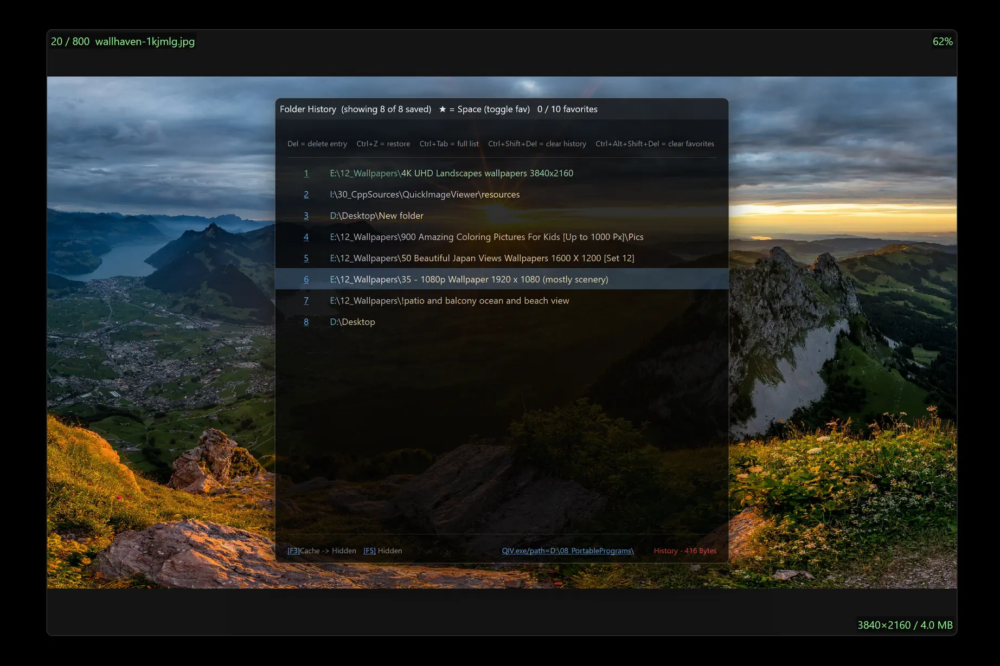
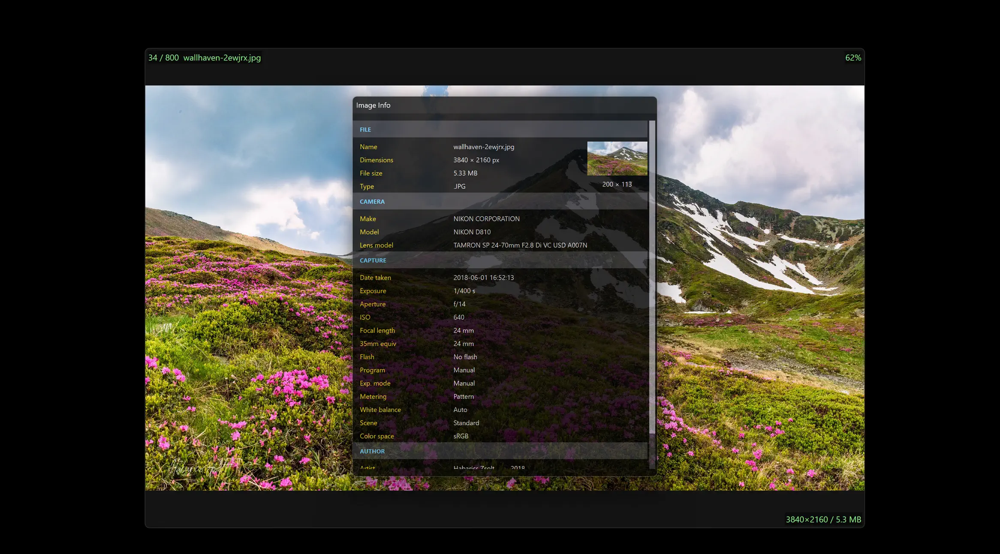
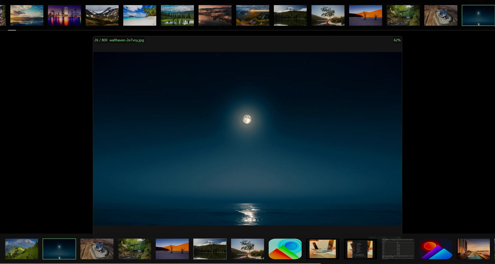
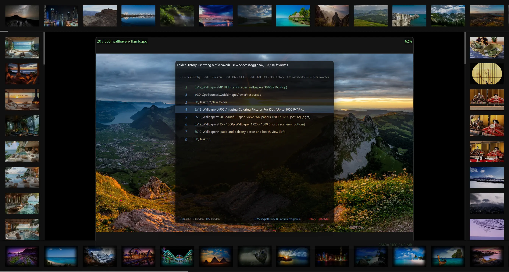
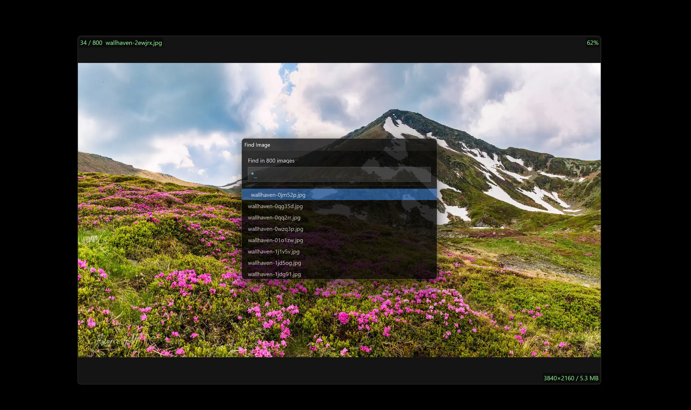

<div align="center">

# QuickImageViewer&nbsp;<sub>(qIV)</sub>

**A fast, GPU-accelerated image viewer for Windows.**

Direct2D, WIC and native Win32. One portable sub-10 MB EXE — no installer, no
telemetry, no background service.

Drives other copies of itself over plain TCP, mirrors one screen to many, and has
**[an Android app](#qiv-remote--the-android-app)** that turns any phone or tablet into a
remote control, a second screen, or a **photo frame your PC drives** — as many of them at
once as you have devices lying around.

[](https://github.com/icyhoty2k/QuickImageViewer/releases/latest)
[](https://github.com/icyhoty2k/QuickImageViewer/releases)
[](#download)
[](LICENSE)
[](https://github.com/icyhoty2k/QuickImageViewer/stargazers)
[](#qiv-remote--the-android-app)
[](https://github.com/icyhoty2k/QuickImageViewer/releases/latest)
[](https://github.com/icyhoty2k/QuickImageViewer/commits)
[](https://github.com/icyhoty2k/QuickImageViewer/pulse)
[](https://github.com/icyhoty2k/QuickImageViewer/issues)
[](https://github.com/icyhoty2k/QuickImageViewer)
[](https://github.com/icyhoty2k/QuickImageViewer)

<br>

[](https://github.com/icyhoty2k/QuickImageViewer/releases/latest)
[](https://github.com/sponsors/icyhoty2k)
[](https://ko-fi.com/ivanhristovyanev)

</div>

---

<details>
<summary><b>Contents</b> — this README is long; jump straight to what you need</summary>

- [Preview](#preview) · [Download](#download) · [Format Support](#format-support) · [How qIV Compares](#how-qiv-compares) · **[qIV Remote for Android](#qiv-remote--the-android-app)**
- **Features** — [Performance](#performance) · [Navigation](#navigation) · [Sorting](#sorting) · [UI Panels](#ui-panels) · [Offline Reverse Geocoding](#offline-reverse-geocoding) · [Thumbnail Strips](#thumbnail-strips) · [File Management](#file-management-on-thumbnail-strips) · [History Panel](#history-panel) · [Slideshow](#slideshow) · [Color Effects](#color-effects) · [Overlay System](#overlay-system) · [Window & Chrome](#window--chrome) · [Mouse Shortcuts](#mouse-shortcuts)
- [System Tray](#system-tray) · [Remote Control & Mirroring](#remote-control--mirroring) · [Architecture](#architecture) · [Build](#build) · [Reporting a Crash](#reporting-a-crash)
- [Found a bug? Want something added?](#found-a-bug-want-something-added) · [Support the project](#support-the-project) · [License](#license) · [Contributing](#contributing)

</details>

---

## Preview

| | |
|:---:|:---:|
| <br>**Main interface** — thumbnail strips and info overlays | <br>**Help window** (F1) — full shortcut reference |
| <br>**Folder History** panel with favorites | <br>**EXIF / Image Info** panel — offline GPS geocoding |
| <br>**Dual thumbnail strips** — VRAM cache (top) and current directory (bottom) | <br>**Four floating directory strips** around the viewer + History panel |
| <br>**Directory strip** — browsing a 4K wallpaper folder | <br>**Statistics panel** — codec, cache and playlist info |
| <br>**Jump-to** dialog — go straight to any image number | <br>**Find** dialog — filename search with `*` and `?` wildcards |

<sub>Shown at 70% scale in WebP. The full-resolution PNGs are in
[`docs/screenshots/`](docs/screenshots).</sub>

---

## Download

<div align="center">

[](https://github.com/icyhoty2k/QuickImageViewer/releases/latest)

</div>

One executable, and **no Visual C++ Redistributable to install** — the C runtime is
linked in. Unblock it if SmartScreen asks, put it anywhere, run it — settings live
in the registry (or an `.ini` beside the EXE with `-config`), and nothing else is
written to your machine unless you switch logging on. To remove qIV, delete the file.

---

## Format Support

| Format | Extensions | Decoder | Notes |
|:---|:---|:---|:---|
| JPEG | `.jpg` `.jpeg` `.jpe` | WIC | Full EXIF / GPS metadata |
| PNG | `.png` `.apng` | WIC | 16-bit, alpha |
| BMP | `.bmp` | WIC | |
| TIFF | `.tif` `.tiff` | WIC | Multi-page (first frame) |
| GIF | `.gif` | WIC | **Animated** — plays with per-frame delays |
| WebP | `.webp` | WIC | Windows 10+ native codec |
| HEIF / HEIC | `.heif` `.heic` `.hif` `.heics` `.heifs` | WIC | Requires MS HEIF Extensions |
| AVIF | `.avif` `.avci` `.avcs` `.avifs` | WIC | Windows 11 native codec |
| JPEG XL | `.jxl` | WIC | Windows 11 24H2+ native codec |
| JPEG XR | `.jxr` `.wdp` `.hdp` | WIC | OS native |
| DDS | `.dds` | WIC | OS native |
| Camera RAW | `.dng` `.cr2` `.cr3` `.nef` `.arw` | WIC | Requires MS Raw Image Extension |
| JPEG 2000 | `.jp2` `.j2k` `.j2c` `.jpf` `.jpx` | OpenJPEG | Static lib |
| SVG | `.svg` | resvg | Rust static lib, async IO thread |
| OpenEXR | `.exr` | tinyexr | Reinhard tone-map + γ2.2 |
| Radiance HDR | `.hdr` | Inline | RGBE adaptive RLE, Reinhard tone-map |
| Targa | `.tga` | Inline | RLE and colour-mapped, 8/15/16/24/32-bit |
| PNM | `.ppm` `.pgm` `.pbm` | Inline | P1–P6, up to 16-bit maxval |
| QOI | `.qoi` | Inline | Lossless fast format |
| ICO / CUR | `.ico` `.cur` | WIC | |

**WIC** = Windows Imaging Component (OS native, zero dependency)  
**Inline** = implemented directly with no third-party library

---

## How qIV Compares

| Feature | qIV | Windows Photos | IrfanView |
|:---|:---:|:---:|:---:|
| **Speed & footprint** | | | |
| GPU VRAM bitmap cache | ✅ Direct2D | ❌ | ❌ |
| Instant image switching | ✅ pre-decoded neighbours | ⚠️ visible load delay | ⚠️ visible load delay |
| Portable — no installer | ✅ sub-10 MB single EXE | ❌ UWP / Store | ✅ |
| No background services | ✅ process exits cleanly | ❌ always-on UWP runtime | ✅ |
| **Formats** | | | |
| HEIC / AVIF / JPEG XL | ✅ native + codec | ✅ | ⚠️ plugin required |
| SVG / OpenEXR / HDR | ✅ built-in | ❌ | ⚠️ plugin required |
| Batch convert & rename | ❌ | ❌ | ✅ |
| Plugin ecosystem | ❌ codecs built in instead | ❌ | ✅ |
| **Viewing & editing** | | | |
| Non-destructive GPU effects | ✅ full D2D effect graph | ⚠️ basic adjustments | ⚠️ CPU, applied to the buffer |
| Crop / paint / resize editing | ❌ effects only, `Ctrl+S` bakes | ✅ | ✅ |
| Configurable info overlays | ✅ 9 independent slots | ❌ | ⚠️ slideshow captions |
| Slideshow transitions | ✅ 21, GPU | ⚠️ basic | ✅ |
| Floating thumbnail panels | ✅ up to 6 simultaneous | ❌ | ⚠️ separate browser window |
| Thumbnail strips as file manager | ✅ drag between folders, shell ops | ❌ | ⚠️ in the browser window |
| Offline GPS geocoding | ✅ embedded, zero network | ❌ | ❌ |
| **Remote & multi-screen** | | | |
| **Android companion app** | ✅ **[qIV Remote](#qiv-remote--the-android-app)** — control, live preview, photo frame | ❌ | ❌ |
| Phone ↔ desktop photo transfer | ✅ both ways, originals not re-encodes | ❌ | ❌ |
| Drive other copies over TCP | ✅ plain-text protocol, self-describing | ❌ | ❌ |
| Mirror one screen to many | ✅ F11, per-target selection | ❌ | ❌ |
| Send an image across machines | ✅ `Alt+Enter`, file bytes on the wire | ❌ | ❌ |
| Scriptable from anything | ✅ `netcat`, shell, home automation | ❌ | ⚠️ local command line only |
| Kiosk / locked display mode | ✅ CLI flag, ignores every key and click | ❌ | ⚠️ limited |
| Starts with Windows, unattended | ✅ `-runOnStartup` + kiosk + keep-awake | ❌ | ⚠️ manual |
| Digital signage / ad loop | ✅ folder in, wall out — no publish step | ❌ | ⚠️ slideshow only |
| Phones, tablets & TVs as extra screens | ✅ as many as you own, no per-screen fee | ❌ | ❌ |
| **Trust** | | | |
| No telemetry / tracking | ✅ zero | ❌ Microsoft telemetry | ✅ |
| No ads | ✅ | ❌ promoted content | ✅ |
| Open source | ✅ AGPLv3 | ❌ | ❌ |
| Per-monitor DPI V2 | ✅ | ✅ | ⚠️ partial |

<sub>✅ built in · ⚠️ partial, or needs a plugin or a separate window · ❌ not available.
IrfanView wins the rows it wins — batch work and real editing are what it is for, and qIV
does not try to replace them.</sub>

---

## qIV Remote — the Android app

<div align="center">

[](#requirements)
[](#)
[](#a-private-network-and-nothing-else)

**Your phone becomes the viewer's remote, a second screen, and a photo frame your PC drives.**

</div>

Point it at your PC over your own network and drive qIV from the sofa, the far side of a
meeting room, or anywhere the keyboard is not. It is a real protocol client, not screen
sharing: it speaks the same verbs `netcat` does, so it stays in step with the desktop
instead of streaming pixels at it.

### Photos travel both ways

This is the part a remote control usually cannot do at all.

| Direction | What travels | Why it is built that way |
|:---|:---|:---|
| **Desktop → phone** — live preview | The current picture, scaled and re-encoded as JPEG **before it leaves the PC** | 25–40× fewer bytes than the original, and a far smaller decode on the phone |
| **Desktop → phone** — Save | The **original file**, byte for byte, into `Pictures/qIVRemote` in your gallery | Save asks for the original *separately* rather than keeping the preview — a re-encoded JPEG is not the file you meant to keep |
| **Phone → desktop** — push | Your photo's own bytes, base64 in chunks | Works to a PC that has never seen the photo and cannot read your phone's storage |

A pushed photo appears on the desktop **once**, over whatever is up. It changes no folder,
no sort order, no playlist position, and a running slideshow keeps running with it
occupying a single slide. Nothing has to be paused first, and nothing is left behind.

Saving to the gallery needs **no storage permission** — the app publishes through
MediaStore, and the entry stays invisible until the transfer finishes, so a gallery
scanning mid-transfer can never show you a half-written thumbnail.

### Turn any spare screen into a photo frame

The same connection runs the other way round. Instead of using the phone to drive the PC,
put it on a stand and let the PC drive **it**.

Open the Fullscreen screen and the device shows whatever the viewer is showing — nothing
else. No toolbar, no buttons, no chrome. Start a slideshow on the PC and the tablet on the
shelf follows it, picture for picture, for as long as you leave it there.

| | |
|:---|:---|
| **An old tablet becomes a photo frame** | The one in a drawer with a cracked case is a perfectly good display. Prop it up, point it at the PC, start a slideshow. |
| **A phone becomes a second monitor for photos** | Cull on the big screen, review at arm's length, hand it to someone across the table. |
| **The PC stays the library** | Your folders, your sort order, your filters, your drives. The screen is a window onto the machine that already has all of it. |

It keeps up **without being asked**. The viewer announces every picture change — including
the ones a slideshow makes on its own, where no key was pressed and no command was sent —
and the screen fetches the new image the moment it hears. Nothing polls, nothing lags a
frame behind.

**It sends nothing back.** The Fullscreen screen has no Next, no Previous, no toolbar, and
that is deliberate rather than unfinished: a control that could nudge a running
presentation from a phone in somebody's pocket is a hazard, not a feature. It asks for two
read-only things and nothing else. Tap anywhere to leave.

What crosses the network is a **preview** — scaled to that screen's size and re-encoded as
JPEG on the PC before it is sent, not the original file. A 6 MB photo shown on a tablet
moves as a few hundred kilobytes. That is what makes it comfortable over Wi-Fi, and what
keeps a frame refreshing all evening from being a bandwidth decision.

**As many screens as you have devices.** Every connected device watches independently, so
one PC can feed the tablet in the kitchen, the phone in the hallway and the spare monitor
on the desk at the same time — all following the same library, all updating together. There
is no per-screen licence, because there is nobody to license it from.

That also makes it **signage and advertising that costs nothing to run**: a shop window, a
waiting room, a menu board, a studio wall. One PC you already own, screens you already
have, your own network. No subscription, no cloud account, no per-display fee, and no
service that can raise its price or shut down and take the wall with it.

And it runs **unattended**, which is the part that decides whether a display is a product
or a chore. The viewer already has every piece:

| | |
|:---|:---|
| **Starts with the machine** | `-runOnStartup`, or the tray toggle. Power comes back after a cut and the wall comes back with it — nobody drives to the shop to click anything. |
| **Ignores everybody** | Kiosk lock (`-lock`) makes the screen ignore every key and every click, so a passer-by cannot pause your loop or open a panel. The tray is the only way back in. |
| **Stays awake** | Keep display awake blocks the screensaver and display sleep, and releases the hold the moment the window hides — a viewer sitting in the tray never keeps a machine up. |
| **Loops by itself** | Slideshow with interval, loop and shuffle, and 21 GPU transitions. Point it at a folder and drop new artwork in — no playlist to rebuild, no re-upload, no publish step. |

Changing what a wall shows is **copying a file into a folder**. That is the whole workflow.

No cloud account, no subscription, no photos uploaded anywhere. The pictures go from your
PC to your screen across your own network, and stop there.

### What else it does

<table>
<tr>
<td width="50%" valign="top">

**Drive the viewer**

Next / previous, first / last. Slideshow with its interval, pause, loop and shuffle.
Zoom, rotate, flip. All five view modes. Colour effects. Fullscreen, always-on-top,
panels and the on-image overlay.

**Jump anywhere**

The viewer's folder history comes down to the phone — tap a folder and the desktop goes
there.

</td>
<td width="50%" valign="top">

**Presentation mode**

The current picture and two large next/previous buttons, sized to press without looking.
Built for talking to a room rather than staring at a phone.

**Follow the desktop**

Bind the connection and the preview keeps itself up to date — when someone changes the
picture at the PC, your phone shows it.

</td>
</tr>
<tr>
<td valign="top">

**As many PCs as you like**

Each saved machine keeps its own address, port and optional password. Tap one to connect.

</td>
<td valign="top">

**Demo mode**

Every screen runs against a viewer that does not exist, so you can see the whole app
before installing anything or opening a port.

</td>
</tr>
</table>

### A private network, and nothing else

The app talks only to the computer whose address you type. There is **no account, no
cloud, no analytics, no advertising**, and nothing is ever sent to the developer — there
is no back end to send it to.

When your PC requires a password it is verified by challenge–response, so **the password
itself never crosses the network**. Off the loopback the connection is TLS with a pinned
certificate, and qIV's own AllowList (`F9`) still decides who may connect at all.
Passwords you choose to save stay in app-private storage on the phone.

### Requirements

It is a companion app and does nothing on its own — the same way a TV remote does nothing
without the TV. You need **QuickImageViewer running on a Windows PC with its Local Server
enabled** (`F9` in qIV), and the phone on the same network. The app's About screen walks
through the setup.

<div align="center">

*Coming to Google Play. Until then, the desktop side is ready and waiting on `F9`.*

</div>

---

## Features

<a id="performance"></a>
<details>
<summary><b>Performance</b></summary>

- **GPU bitmap cache** — decoded images live in VRAM, preloaded in both directions
- **Background decode** — worker thread pool; UI thread never blocks on IO
- **Instant startup** — process stays resident in RAM after first launch (hide to tray with `Esc`, recall instantly)
- **Software fallback** — GDI renderer for edge cases where Direct2D is unavailable

</details>

<a id="navigation"></a>
<details>
<summary><b>Navigation</b> <sub>14</sub></summary>

| Shortcut | Action |
|:---|:---|
| `→` / `←` or Wheel | Next / previous image |
| `Space` / `Shift+Space` | Next / previous image |
| `Backspace` | Smart jump between first and last image (goes to whichever is further) |
| `Shift+Backspace` | Return to image before the first/last jump |
| `E` | Toggle between current and previously viewed image |
| `Q` | Toggle between current and previously opened folder |
| `J` / `Ctrl+G` | Jump to image by number (type `@` to switch to Find mode) |
| `Ctrl+F` | Find by filename — wildcard support (`*`, `?`); type `#` to switch to Jump mode |
| `L` | Reveal current file in Windows Explorer |
| `PageUp` / `PageDown` | Previous / next folder in your history — walks only the **non-starred** rows |
| `Insert` / `Delete` | Next / previous **favourite** folder — walks only the starred rows |
| Horizontal Wheel | Cycle through navigation history folders (one change per 3 notches) — unlike the four keys above, this walks **every** row, starred or not |
| `F2` | Open-file dialog |
| Drag & Drop | Drop a file or folder onto the window |

</details>

<a id="zoom-pan--view-modes"></a>
<details>
<summary><b>Zoom, Pan & View Modes</b> <sub>7</sub></summary>

| Shortcut | Action |
|:---|:---|
| `↑` / `↓` | Zoom in / out, ×1.1 per step |
| `Num +` / `Num -` | Zoom in / out — same steps as `↑` / `↓` |
| Numpad `*` | Reset zoom and pan to the active view mode's default fit |
| `0` | Open the Zoom panel and type an exact percentage |
| `W` / `A` / `S` / `D` | Pan the viewport when the image is larger than the window — 30 px per press, DPI-scaled |
| `1` – `5` | View mode: **1** Fit to view (keeps aspect) · **2** Fit to width · **3** Fit to height · **4** Fill window · **5** Original size, 1:1 pixels |
| `Y` | **Lock Viewport** — carry zoom and pan to the next image instead of resetting, so flipping through same-framed shots holds the same detail at the same magnification. Rotation and flips still reset, because each file's EXIF orientation tag owns those |

`W`/`A`/`S`/`D` pan on their own, move the window with `Shift`, and `Ctrl+W` / `Ctrl+S`
keep their usual meanings (hide the app, save the edited image).

</details>

<a id="sorting"></a>
<details>
<summary><b>Sorting</b> <sub>5</sub></summary>

| Shortcut | Order |
|:---|:---|
| `Ctrl+Alt+Shift+0` | By name (natural / Explorer order) — press again to reverse |
| `Ctrl+Alt+Shift+9` | By date modified — press again to flip newest ↔ oldest |
| `Ctrl+Alt+Shift+8` | By file size — press again to flip largest ↔ smallest |
| `Ctrl+Alt+Shift+7` | By extension — press again to reverse |
| `Ctrl+Alt+Shift+6` | By physical disk order (fastest for HDDs) |

</details>

<a id="ui-panels"></a>
<details>
<summary><b>UI Panels</b> <sub>8</sub></summary>

| Panel | Shortcut | Description |
|:---|:---|:---|
| Help | `F1` | Full shortcut & CLI reference — 2-column, double-buffered, DPI-aware. `Ctrl+E` exports to Desktop as UTF-8 text. |
| EXIF / Info | `M` | Full metadata: camera, exposure, GPS with offline geocoding, embedded preview thumbnail |
| Statistics | `K` | Decode time, codec, file details and cache info for the current image |
| Directory | `F6` *(or Right Shift)* / `F7` | All images in current folder; syncs selection with viewer / moves panel to next screen edge |
| Cache | `F3` / `F4` | Live GPU cache occupancy, thumbnails of preloaded images / moves panel |
| Clear cache | `Ctrl+F3` | Empty the VRAM cache — images are re-decoded on demand afterwards |
| Reload | `F5` | Refresh / reload the current directory from disk |
| History | `Tab` | Recent folders with favorites — `Shift+Enter` spawns a DirWnd without leaving current folder |

</details>

<a id="offline-reverse-geocoding"></a>
<details>
<summary><b>Offline Reverse Geocoding</b> <sub>4</sub></summary>

GPS coordinates in EXIF are resolved to full location data with **zero network calls**. All data is compressed (zlib) and embedded directly in the EXE.

| Data | Source | Entries | Shows |
|:---|:---|:---|:---|
| Cities | GeoNames cities1000 | 170,387 | City name, timezone |
| Admin1 | admin1CodesASCII | 3,865 | State / Province |
| Admin2 | admin2Codes | 47,549 | District / County |
| Country | countryInfo | 252 | Country, Capital, Continent, Currency, Phone prefix |

Example output in the EXIF panel for a photo taken in Paris:
```
City        Paris
District    Paris
State       Ile-de-France
Country     France
Continent   Europe
Capital     Paris
Currency    EUR (Euro)
Phone       +33
Timezone    Europe/Paris
```

</details>

<a id="thumbnail-strips"></a>
<details>
<summary><b>Thumbnail Strips</b></summary>

All thumbnail panels (Cache, Directory, and spawned DirWnds) share the same behaviour:

- **Scroll** — mouse wheel; hold Shift for 3× speed
- **Wrap-around** — `B` toggles wheel wrap: scrolling past the last thumbnail jumps to the first (and vice-versa). A center overlay message confirms each wrap. Startup default is controlled by `THUMBNAIL_PANEL_WHEEL_WRAP_AROUND` in `Constants.h`.
- **Visual effects** — `U` is the master runtime switch for the strip's rounded corners, the accent glow on the selected thumbnail and the hover-scale enlarge. Each effect can also be disabled individually in `Constants.h`
- **Open** — left-click any thumbnail to open it in the main viewer
- **Drag** — click and drag the strip to scroll freely
- **Scrollbar** — thin bar on the inner edge; click-drag for quick scrubbing
- **Spawn DirWnd** — from the History panel, `Shift+Enter` or **MMB click** on an entry opens a floating directory strip for that folder without leaving the current one (up to 4 simultaneous strips, pre-allocated and reused for instant spawning). If a strip is already open for that folder, the same gesture hides it instead (toggle)
- **Active strip** — clicking any directory strip makes it the *active* panel; all subsequent folder navigation (History `Enter`, folder changes) targets that strip. The primary `F6` strip is the fallback when no spawned panel has been clicked
- **Close with MMB** — middle-mouse-button click on any directory strip or floating panel (Help, EXIF, Stats, Jump-to, Find) closes it immediately

</details>

<a id="file-management-on-thumbnail-strips"></a>
<details>
<summary><b>File Management on Thumbnail Strips</b></summary>

Directory strips double as a lightweight file manager:

- **Drag & drop between strips** — drag a thumbnail from one directory strip and drop it on another to **move** the file. Hold `Ctrl` while dropping to **copy** instead; the mouse cursor shows which operation is active. Both panels refresh automatically and every operation goes through the Recycle-Bin-aware Windows shell (undo with `Ctrl+Z` in Explorer).
- **Right-click context menu** — Copy, Cut, Delete and Paste on any thumbnail:
  - **Copy / Cut** — puts the file on the Windows clipboard (works with Explorer too). A cut file is shown dimmed until pasted.
  - **Paste** — drops clipboard files into the strip's folder; both source and destination strips refresh instantly.
  - **Delete** — sends the file to the Recycle Bin.

</details>

<a id="history-panel"></a>
<details>
<summary><b>History Panel</b> <sub>11</sub></summary>

| Shortcut | Action |
|:---|:---|
| `Tab` | Toggle History panel |
| `Ctrl+Tab` | Toggle full (uncapped) view and refresh the folder snapshot |
| *type anything* | Filter the list — fuzzy by default, wildcards (`*`, `?`) when the query contains one. Matched characters are highlighted in the row |
| `Esc` / `✕` | Clear the filter (`Esc` closes the panel when the filter is already empty) |
| `Enter` | Open hovered folder in main viewer |
| `Shift+Enter` | Spawn / hide a floating DirWnd for the hovered folder (toggle) |
| `MMB click` on a row | Spawn / hide a floating DirWnd for the hovered folder (panel stays open) |
| `Space` | Toggle favorite on hovered entry (types a space once the filter has text) |
| `Ctrl+Delete` | Delete hovered entry (`Ctrl+Z` restores last deleted) |
| `Ctrl+Shift+Delete` | Clear all history, keep favorites |
| `Ctrl+Alt+Shift+Delete` | Clear all favorites, keep history |

</details>

<a id="slideshow"></a>
<details>
<summary><b>Slideshow</b> <sub>5</sub></summary>

| Shortcut | Action |
|:---|:---|
| `Ctrl+F1` | Start / stop slideshow |
| `Space` *(while running)* | Pause / resume |
| `R` *(while running)* | Toggle loop |
| `S` *(while running)* | Toggle shuffle |
| `T` *(while running)* | Step to the next transition (21 available, wraps) |

</details>

<a id="color-effects"></a>
<details>
<summary><b>Color Effects</b> <sub>15</sub></summary>

All effects are non-destructive and GPU-accelerated via the Direct2D effect graph. `Ctrl+S` saves the result to disk.

Every colour effect requires **Ctrl**. The plain presses of the same keys belong to navigation — `Home` / `End` jump to the first / last image, `Page Up` / `Page Down` walk the history folders and `Insert` / `Delete` walk the favourites.

| Effect | Key |
|:---|:---|
| Rotate CW / CCW | `R` / `Shift+R` |
| Flip horizontal / vertical | `H` / `V` |
| Grayscale | `Ctrl+Delete` |
| Invert | `Ctrl+Insert` |
| Sepia | `Ctrl+Home` |
| Solarize (>50% brightness inverted) | `Ctrl+End` |
| Outline (GPU edge detection) | `Ctrl+Page Up` |
| Threshold (black & white at 50%) | `Ctrl+Page Down` |
| Brightness ± | `Ctrl+\` / `Ctrl+'` |
| Contrast ± | `Ctrl+/` / `Ctrl+.` |
| Saturation ± | `Ctrl+]` / `Ctrl+[` |
| Gamma ± | `Ctrl+=` / `Ctrl+-` |
| Toggle all effects (bypass) | `` ` `` |
| Reset all effects | `Num 0` |
| Save with effects baked in | `Ctrl+S` |

</details>

<a id="overlay-system"></a>
<details>
<summary><b>Overlay System</b> <sub>11</sub></summary>

9 independently configurable data slots rendered on the image canvas.

```
[Ctrl+1] Top Left    [Ctrl+2] Top Center    [Ctrl+3] Top Right
[Ctrl+4] Mid Left    [Ctrl+5] Center        [Ctrl+6] Mid Right
[Ctrl+7] Bot Left    [Ctrl+8] Bot Center    [Ctrl+9] Bot Right
```

What each slot carries: **1** index + filename · **3** zoom % · **5** centre message
area · **7** active effects + folder name · **9** dimensions + file size. Slots **2**,
**4**, **6** and **8** show the thumbnail-strip selection count for the panel on that
edge.

| Shortcut | Action |
|:---|:---|
| `N` / `I` / `Ctrl+0` | Master toggle — show / hide all slots |
| `Ctrl+1` – `Ctrl+9` | Walk one slot through **Compact → Full → Off** — compact is one line instead of two. `Ctrl+5` (centre messages) has no compact form, so it cycles On → Off |
| `O` | Cycle overlay layout: Grid → Stacked → Summary |
| `P` | Toggle semi-transparent background behind overlay text |

Appearance is set from the tray menu's **Overlays** submenu rather than by shortcut:

| Item | Effect |
|:---|:---|
| Layout | Grid / Stacked / Summary — the same three `O` cycles through |
| Font | Typeface used by every overlay slot |
| Font Size | Point size, shown in the label |
| Font Color… | Colour picker for overlay text |
| Message Duration | How long a centre-screen message stays up, in milliseconds |

The nine slots are listed there too, each named for what it carries — Top Left
(Index / File), Top Right (Zoom), Mid Center (Messages), Bot Left (Effects), Bot Right
(Dimensions), and the four Panel Selection slots. Each opens a **three-state radio
group — Compact / Full / Off**, the same cycle its `Ctrl+N` key walks. Mid Center is
always single-line, so it offers only On / Off. **Bot Left** carries two extra toggles
above its radio group, because they decide whether there is anything to format:
**Effects** (the active colour-effect list) and **Folder Name** (the containing folder
beside the file name).

</details>

<a id="application-lifecycle"></a>
<details>
<summary><b>Application Lifecycle</b> <sub>5</sub></summary>

| Shortcut | Action |
|:---|:---|
| `Esc` / `Ctrl+W` | Hide to the system tray — the process stays resident so the next open is instant. Extra running instances are closed |
| `Ctrl+Q` | **Hard quit** — fully removes the process from memory |
| `Ctrl+N` | Open a new independent qIV window |
| `Shift+Delete` | Reset everything — window layout and all effects return to defaults (same as `Alt+X`) |
| `Ctrl+C` | Copy the current image to the clipboard |

</details>

<a id="window--chrome"></a>
<details>
<summary><b>Window & Chrome</b> <sub>16</sub></summary>

| Shortcut | Action |
|:---|:---|
| `F` / `Enter` / `Ctrl+Shift+T` | Toggle borderless fullscreen |
| `Ctrl+Enter` / `Alt+Enter` / `Ctrl+Alt+Enter` | Send this position / stream this image / fetch its image — see [Remote Control](#remote-control--mirroring) |
| `Ctrl+Shift+Enter` | Send this position to **every** connected instance, not only the ticked ones |
| `Ctrl+T` / `Ctrl+A` | Toggle always-on-top |
| `Ctrl+M` | Move the window to the **next monitor**, wrapping at the last. Screens are ordered left to right by their desktop position, and the window keeps its relative size and place — so a window sized for a 4K screen does not land half off a 1080p one. The overlay names the monitor it moved to |
| `Shift+W/A/S/D` | Nudge window 20 px up / left / down / right |
| `Alt+W/A/S/D` | Snap to top / left / bottom / right half of work area |
| `Alt+Q/E/Z/C` | Snap to top-left / top-right / bottom-left / bottom-right quarter |
| `Alt+X` | Reset window size, position and all effects |
| `Shift+Num+/-` / `Shift+=/−` | Grow / shrink window by 20 px per side |
| Drag near screen edge | Snap to that edge (within 24 px) |
| `Ctrl+Space` | Toggle: fit viewer to work area (avoiding visible panels) ↔ restore default size centered on monitor |
| `Ctrl+Alt+Num+/-` | Step all panel colors lighter / darker at runtime |
| `Ctrl+Alt+Num 0` | Reset theme brightness to compiled default |
| `Ctrl+Shift+Num *` | Toggle window corners: rounded ↔ square |
| `Ctrl+Shift+Num /` | Cycle backdrop material: None → Mica → Acrylic → MicaAlt |

</details>

<a id="mouse-shortcuts"></a>
<details>
<summary><b>Mouse Shortcuts</b> <sub>13</sub></summary>

| Input | Action |
|:---|:---|
| Wheel | Previous / next image |
| Ctrl+Wheel | Zoom in / out centered on cursor |
| Shift+Wheel | Adjust window opacity in 10% steps |
| Horizontal Wheel | Cycle navigation history folders |
| LMB hold | Quick zoom 3× centered on cursor |
| LMB drag *(while zoomed)* | Pan; reverts on release |
| LMB double-click | Toggle fullscreen |
| RMB drag | Move window |
| RMB + LMB | Reveal current file in Explorer |
| RMB + Wheel | Zoom in / out |
| RMB + Horizontal Wheel | Live-resize window from center (20 px per notch) |
| MMB click | Full visual reset: zoom, pan, opacity; center and resize window |
| MMB drag | Live-resize window from top-left |

> Button roles assume `SWAP_MOUSE_BUTTONS = true` in `Constants.h` (default). Set to `false` to exchange left and right button functions.

---

</details>


## System Tray

When QIV is hidden or running in the background, its icon appears in the system tray. All persistent settings are accessible from the right-click context menu — no config files to edit.

**Tray icon actions:**

| Action | Result |
|:---|:---|
| Double-click | Restore the main window to the foreground |
| Right-click | Open the context menu |

**Context menu top-level items:**

| Item | Action |
|:---|:---|
| Restore QuickImageViewer | Show and focus the main window |
| Help / Shortcuts | Open the in-app help window |
| Exit Completely | Remove the tray icon and fully quit the process |

<a id="settings-submenu"></a>
<details>
<summary><b>Settings submenu</b> <sub>25</sub></summary>

All toggles save immediately and are reflected live.

**Boolean toggles (checkmarks):**

| Setting | Effect |
|:---|:---|
| Keep in Background | Esc / Ctrl+W hides to tray instead of exiting; process stays resident for instant re-open |
| Run on Startup | Write / remove a Windows startup registry entry (`HKCU\…\Run`). Dedicated instances use a separate entry |
| Thumbnail Effects | Master switch for glow borders, rounded corners and hover-scale on thumbnail strips |
| History: Open Full List | Tab opens the full uncapped history view when enabled |
| Info Overlays | Show / hide all nine overlay text slots |
| Open Thumbnail Strip on Start | Auto-open the directory strip on every launch |
| Overlay Background | Semi-transparent background panel behind overlay text |
| Swap Mouse Buttons | Exchange left/right button roles: hold-to-zoom ↔ drag-to-move-window |
| Invert Scroll Direction | Reverse vertical wheel for image navigation |
| Invert Horizontal Scroll | Reverse horizontal wheel for folder history navigation |
| Start in Fullscreen | Open fullscreen on every launch |

**Numeric settings** (click any label to open an input dialog; current value is shown in the label):

| Setting | Range | Effect |
|:---|:---|:---|
| VRAM Cache Size | 0 – 999 | Images to keep decoded in GPU memory |
| Window Width / Height | 240 – 16000 px | Default dimensions used by Ctrl+Space and window reset |
| History Max Dirs / Favs | 0 – 999 | Items shown in the History panel |
| Dir Thumb Cache | 100 – 64000 MB | Memory budget for directory thumbnail bitmaps |
| Preload Lookaside | 1 – 99 | Images to pre-decode ahead and behind the current one |
| Overlay Message Duration | 250 – 10000 ms | How long center overlay messages stay visible |
| History Save Limit | 1 – 99999 | Folders persisted to disk between sessions |

**Settings file operations:**

| Item | Effect |
|:---|:---|
| Export Settings | Save all settings to a UTF-8 `.ini` file (default filename includes today's date) |
| Import Settings | Load a previously exported `.ini` file — confirmation required; all settings applied immediately |
| Restore Defaults | Reset every setting to its compiled-in default — confirmation required; history and favorites are not affected |

</details>

<a id="view-mode-submenu"></a>
<details>
<summary><b>View Mode submenu</b></summary>

Pick the default fit mode (radio buttons): **1** Fit to view (aspect) · **2** Fit to width · **3** Fit to height · **4** Stretch to window · **5** Original size.

</details>

<a id="slideshow-submenu"></a>
<details>
<summary><b>Slideshow submenu</b></summary>

Set default interval (100 – 60000 ms), toggle Loop and Shuffle, and choose the default transition type (Cut / Fade / Dissolve / Ripple / Push / Zoom). All changes persist.

</details>

<a id="sort-submenu"></a>
<details>
<summary><b>Sort submenu</b></summary>

Choose sort order: **Name** / **Date Modified** / **Size** / **Type** / **Disk Order**, plus a **Reverse Order** toggle. Takes effect immediately on the current folder.

</details>

<a id="backup-submenu"></a>
<details>
<summary><b>Backup submenu</b> <sub>2</sub></summary>

| Item | Effect |
|:---|:---|
| Backup History & Favorites | Export history and favorites to a `.zip` archive (file-save dialog) |
| Restore History & Favorites | Restore from a previously created backup — confirmation required |

</details>

<a id="logging-submenu"></a>
<details>
<summary><b>Logging submenu</b> <sub>3</sub></summary>

Both logs are **off by default** and survive a restart once switched on — which is the
point of them. A screen that misbehaves at four in the morning is exactly the one nobody
was watching, so the setting is persisted rather than something you must remember to
enable first.

| Item | Effect |
|:---|:---|
| General Log | What qIV itself did — started, closed, and whether the previous run ended abnormally (with the crash dump's filename when there is one) |
| TCP/IP Log | Every line exchanged with a remote client — the same traffic the Server Log panel shows (`Ctrl+F12`), written to disk as well |
| Open Log Folder | Opens `logs\` in Explorer |

Files land in `logs\general\` and `logs\network\` beside the EXE, named
`QuickImageViewer_General_<timestamp>.log` and `QuickImageViewer_Tcp_IP_<timestamp>.log`,
rotating every 5000 lines. Switching a log off and on again continues the newest file
rather than starting a fresh one.

The format is the standard `time [thread] LEVEL message` layout, so
[LogViewPlus](https://www.logviewplus.com/), lnav and similar tools parse it with no
configuration — and a rotated TCP/IP file opens straight back in the Server Log panel
with `Ctrl+O`.

Writing happens on a thread of its own. A slow disk cannot stall the viewer, and with a
log switched off the cost at each record point is a single atomic read.

</details>

<a id="dedicated-screens"></a>
<details>
<summary><b>Dedicated Screens</b> <sub>10</sub></summary>

Press `F8` for the Dedicated panel. A **dedicated screen** is a separate copy of qIV with its own settings file beside it — normally parked fullscreen on one monitor running a slideshow. Any number can run at once, alongside the main app, sharing nothing.

**How a copy is identified.** Everything derives from the executable's own path:

```
D:\Screens\qIV_dedicated_Lobby.exe        the copy
D:\Screens\qIV_dedicated_Lobby.ini        its settings
D:\Screens\imageLists_qIV_dedicated_Lobby.qim     image folders
D:\Screens\promotionList_qIV_dedicated_Lobby.qpr  promotion folders
```

Two files cannot share a name in one folder, so two screens can never resolve to the same settings, mutex or window class.

**Startup decision**, made from the filesystem before any setting is read:

| Condition | Result |
|:---|:---|
| An `.ini` sits beside the exe | Settings come from it; the registry is never touched |
| Exe name contains `dedicated`, no `.ini` | A default `.ini` is generated and the F8 panel opens |
| Neither | Normal registry-backed launch |

Inside the `.ini`, `[Instance]Dedicated` decides behaviour — `1`/`true`/`on`/`yes` or any non-zero number. Set it to `0` and you get a **portable** ordinary viewer: settings in a file, history and favorites intact, nothing in the registry.

**Panel buttons**

| Button | Action |
|:---|:---|
| Generate App | Copy this executable to a chosen folder as `qIV_dedicated_<name>.exe` |
| Generate Config | Write that copy's `.ini`, holding every setting shown in the panel |
| Add Images / Add Promotions | Append a folder to the `.qim` / `.qpr` list — duplicates reported and skipped |
| Add Startup / Remove Startup | Create or delete a `shell:startup` shortcut pointing at the copy |
| Test Config / Test Images / Test Promos | Check one thing at a time |

The panel edits the **config only** — it never changes the app you are using, and every value starts from the compiled defaults rather than your current settings, so a screen never inherits the authoring machine's preferences.

`Test Images` / `Test Promos` count the images actually found per folder and flag folders that are missing or empty. A folder that exists but holds nothing decodable looks identical to a working one until the screen goes blank.

**Kiosk lock.** Tick **Kiosk lock** in the panel and the screen ignores every key and every click — nobody walking past can pause the slideshow or open a panel. The tray icon keeps working (its menu runs its own message loop, so the locked window never sees those messages), and **Settings › Kiosk Lock** there is the only way back in. The main app has the same toggle in its tray menu, and `-lock` forces it on for a single launch without changing the stored setting.

**Always on top.** Keeps the screen above every other window so nothing that pops up can cover it. `Ctrl+T` toggles it live and the setting persists; the panel sets it for a generated screen.

**Keep display awake.** Blocks the screensaver and display sleep while the window is on screen. Leave it off and Windows eventually blanks the display with nobody there to wake it — and with the kiosk lock on, nobody could. The hold is released automatically when the window hides to the tray, so a viewer sitting in the tray never keeps a machine up.

**Isolation.** A dedicated screen writes *nothing* to the registry, keeps no history or favorites, and has its own mutex and window class — so a file opened from Explorer can never land on a slideshow instead of the main window. It auto-starts from a shortcut rather than the `Run` key.

</details>

<a id="promotions"></a>
<details>
<summary><b>Promotions</b> <sub>5</sub></summary>

A dedicated screen can interleave a **second playlist** with its images — never merged into them, and invisible to the image counter and arrow keys.

| Setting | Meaning |
|:---|:---|
| Pick | `Sequential` (folder order) or `Weighted by priority` |
| Priority | From a `#N` suffix on the filename — `sale#500.jpg` is 500× likelier than a file with no suffix. Range 1–65535 |
| Every N images | Gap counted in pictures |
| Every N seconds | Gap counted in wall-clock time |
| Shown for | Promotion dwell time, independent of the slide interval |

Both triggers are `(from, to)` pairs and run **independently** — set either, or both, and whichever comes due first shows a promotion:

- `(0, 0)` — off
- `(5, 0)` — exactly every 5
- `(5, 15)` — re-rolled between 5 and 15 each time, so it never looks mechanical

---

</details>


## Remote Control & Mirroring

One qIV can drive others — a wall of screens from the copy on your desk, or a single
display in another room. It is plain UTF-8 line protocol over TCP, so a script,
`netcat`, a home-automation system or a phone app are all first-class clients.

| Shortcut | Panel / Action |
|:---|:---|
| `F9` | **Local Server** — the listener *this* instance runs. Off unless switched on; needs a name and a port |
| `Ctrl+F9` | **My Clients** — who is connected to *your* listener right now: address, the name and platform each gave, whether it is encrypted, how long it has been on, and whether it is watching. Kick, kick-for-N-minutes, or ban from here |
| `F10` | **Remote Servers** — the instances this copy can drive. Connect, start/stop, watch, sync |
| `Ctrl+F10` | **Send Command** — pick any wire command from the list, give it a value, send it |
| `F11` | **Mirroring on/off** — forward every mirrorable command to the connected targets |
| `Ctrl+F11` | **Mirroring** — which connected servers receive what this instance does, plus Identify and Watch |
| `F12` | While mirroring, **also execute here** (off = this viewer is a pure remote control) |
| `Ctrl+F12` | **RemoteLog** — every line that crossed the wire, both directions, with round trips — plus a line each time a client arrives, leaves, drops or is refused, naming its address and port and how long it stayed |

**Announce (beacon)** (first item in the TCP/IP menu, off by default). The server publishes itself over
mDNS as `_qiv._tcp`, so a phone or another qIV **finds it in a list instead of being told
an address to type**. That one step — read your PC's LAN address, type it without a typo on
a phone keyboard, know what a port is — is where most people give up.

It announces **only the instance name and the port**. Never a password, never a path, never
a file. And discovery is not access: the AllowList, the password challenge and TLS are
untouched by it, so someone who finds this instance and is not allowed in gets exactly as
far as someone who guessed the address.

Off by default on purpose — this app's whole posture is that nothing leaves your network
unasked, and a machine that started advertising itself the moment you enabled the server
would be a change to that made on your behalf. It also only announces while the server is
actually **running and reachable**: with the listener stopped, or bound to `127.0.0.1`, the
menu says *will announce* rather than claiming it did.

F11 and F12 are session-only and always start **off** — a viewer that came back from a
restart already driving machines you had forgotten about would be the worst kind of
surprise.

### Putting one picture on another screen

Four keys, one question at four depths:

| Key | What travels | Across machines | The far end |
|:---|:---|:---:|:---|
| `Ctrl+Enter` | a **position** — folder, sort order, image number | ✗ same machine only | goes there and **stays** |
| `Alt+Enter` | the **image bytes**, outbound | ✅ | shows it **once**, unchanged otherwise |
| `Ctrl+Alt+Enter` | the **image bytes**, inbound | ✅ | is only read from — you see what it shows |
| `Ctrl+Shift+Enter` | the same **position**, to *every* connected instance | ✗ same machine only | the whole wall goes there and **stays** |

`Ctrl+Shift+Enter` is `Ctrl+Enter` widened: it ignores the Control ticks in `Ctrl+F11`
and pushes to everything connected, for lining a whole wall up at once without first
ticking rows you are about to untick again.

**`Ctrl+Enter` asks before it sends.** It queries the target: already in the same folder
in the same order? Then just the image number — one round trip, no rescan, no flicker,
so you can walk a folder and push each picture as you reach it. In a different folder?
Then the folder, then the sort order, then — after waiting for that instance's own scan
to finish — the number. Sending a position before the scan lands is the race this
avoids.

**`Alt+Enter` / `Ctrl+Alt+Enter` carry the picture's own file bytes**, base64 across
several protocol lines, and the far end decodes them with its own decoder. That is why
they work to a machine that cannot read your disk. The received image is shown **once**
and changes nothing else: no folder, no sort order, no playlist position. A target
running a fullscreen slideshow keeps running it and simply continues from the pushed
image — the picture never enters its playlist, and both the received file and its cache
entry are thrown away afterwards. An advert dropped between two slides is the case it
was built for.

### The Send Command panel (`Ctrl+F10`)

Every command has one wire name, spelled exactly like its internal enumerator, and the
panel's list is built from the same table the parser accepts — so a name shown there
cannot come back "unknown command".

- **Browse, don't remember** — the list is permanent and filterable; names are shown in
  two blues, the second marking a command that takes a value
- **Descriptions where they belong** — what the highlighted command does sits over the
  list, what its value means sits over the Value box, with units, limits and an example
- **Send to** — its own box of connected instances with a checkbox each, so an arbitrary
  command reaches an arbitrary subset without disturbing what `F11` drives
- **Session log** — every line sent and every answer, numbered, newest first, with the
  instance that answered and its round trip

> **The phone client has its own section** — see
> [qIV Remote for Android](#qiv-remote--the-android-app), which speaks exactly the
> protocol described here.

### The protocol describes itself

```
$ nc 127.0.0.1 7777
OK qIV 2.190.0.235 remote v6 [Monitor2]
OK
help
qIV remote protocol v6
FORMAT CMD <name>|<takesValue 0|1>|<description>|<value description>
CMD NextImage|0|next image in the playlist|
CMD JumpToImage|1|go to a numbered image in the current playlist|image NUMBER, 1-based …
…
```

`help` lists everything this build accepts with its descriptions, so a client builds its
own command list from one call instead of carrying a copy that goes stale. `ping` checks
liveness, `version` reports app and protocol version.

Since **protocol v5** exactly one line always follows the banner, so a client never has to
guess: `AUTH <iterations> <salt> <nonce>` when the server wants a password, or a bare `OK`
when it does not — which is the `OK` on the second line above. A successful `AUTH` is
answered `OK` as well. Nothing is signalled by silence, so no client needs a timeout to
discover what kind of server it reached.

### Security

**Encryption is decided by the address, and never negotiated.** A peer on the same machine
(`127.0.0.0/8`, `::1`, `localhost`) gets plaintext; **every** other peer — your own LAN
included — gets TLS 1.2/1.3 from the first byte, before the banner. One listener on
`0.0.0.0` serves both. Both ends decide from the address independently, so there is no
offer on the wire for an attacker to strip and no plaintext fallback to force.

The certificate is self-signed and the client **pins** it by SHA-256 fingerprint — no CA
chain, which is right for a box no public CA would ever issue for. The fingerprint is
shown at the bottom of the `F9` panel; read it there and enter it in the client. A client
with no pin stored refuses to connect rather than trusting what it is handed.

**A password is compulsory off loopback** — the listener refuses to start without one. It
never crosses the wire: the server stores a PBKDF2-HMAC-SHA256 digest (210,000 iterations)
and the client answers an HMAC over a fresh per-connection nonce. Each guess costs the
guesser a full derivation and the server one HMAC, which is the right way round. Five
failures from one address within ten minutes blacklists it, every failure is answered a
second late, and a peer that connects and then goes quiet is dropped after ten seconds.

**AllowList / BlackList take addresses, never domain names** — a rule is matched against
the address a connection actually arrived from, so DNS never enters the access decision.
An empty AllowList denies everyone, by design. Both lists accept:

| Form | Example | Notes |
|:---|:---|:---|
| everything | `*` | |
| text prefix | `192.168.1.*` | **compares characters** — see below |
| CIDR | `192.168.0.0/24`, `2001:db8::/32` | either family, any prefix length |
| range | `192.168.0.10-50` | shorthand: last octet |
| range, full | `192.168.0.10-192.168.1.5` | crosses octet boundaries |
| one host | `192.168.0.5`, `2001:db8::1` | compared numerically, so spelling does not matter |

> ⚠️ The star is a **string** prefix, not an octet boundary. `192.168.1.*` is what it looks
> like, but `192.168.1*` — no trailing dot — also matches `192.168.10.x` and
> `192.168.100.x`, and `1*` matches most of the internet. Use `/24` when the boundary
> matters. Entries that could never match an address are dropped when you save, and the
> panel names what it dropped.

**File-altering commands — delete, move, paste, save — are *structurally* unreachable over
the wire:** a compile-time assertion proves none of them has a row in the command table,
and the executor refuses them again at run time.

> **Exposing it to the internet.** Authentication is the only boundary — behind it, a peer
> can do what someone sitting at the viewer can, including opening a local path and
> pulling the displayed image back. The AllowList is address-based, so a client on a
> dynamic IP pushes you toward `*` and leaves the password as the sole gate. Prefer a VPN
> (WireGuard, Tailscale) over port-forwarding: every protection above still applies, the
> AllowList becomes meaningful again with stable addresses, and the listener stops being
> reachable by anyone who scans the port.

**Full design record:** [`docs/REMOTE_MIRRORING.md`](docs/REMOTE_MIRRORING.md)

---

## Command-Line Arguments

```
QuickImageViewer.exe [image_path] [options]
```

<a id="every-switch"></a>
<details>
<summary><b>Every switch</b> <sub>28</sub></summary>

| Argument | Description |
|:---|:---|
| `"path\to\image.jpg"` | Open this image at startup and browse its folder |
| `-startFolder <path>` | Open this folder as the browse / slideshow source |
| `-background` | Start hidden in the system tray (service mode) |
| `-fullscreen` | Start in fullscreen |
| `-windowedView` | Start windowed (explicit override) |
| `-alwaysOnTop` | Keep window above all others from launch |
| `-monitorNum#N` | Open centered on monitor N (1-based, e.g. `-monitorNum#2`) |
| `-slideshow` | Auto-start slideshow after content loads |
| `-slideshowInterval N` | Seconds between slides (e.g. `-slideshowInterval 8`) |
| `-repeat` | Loop the slideshow when it reaches the end |
| `-shuffle` | Play slideshow in random order |
| `-slideshowTransition=<type>` | Transition by name — 21 available (`Fade`, `Iris`, `SlideLeft`, `ZoomIn`, `Spin`, …) |
| `-slideshowTransitions=<list>` | Custom set, by name or by the numbers shown in the menu (`Fade,Iris,Spin` or `6,8,1`) |
| `-slideshowTransitionSource=<none\|all\|list>` | Which transitions are in play |
| `-slideshowTransitionOrder=<sequential\|random>` | How the next one is drawn from that set |
| `-slideshowTransitionShuffle` | Legacy shorthand for `source=all order=random` |
| `-hideMouse` | Hide the mouse cursor at startup |
| `-lock` | KIOSK mode — all keyboard and mouse input is ignored; unlock from the tray |
| `-keepDisplayAwake` | Block the screensaver and display sleep while the window is on screen |
| `-dedicated` | Run as a dedicated screen — no registry writes, no history, own icon, mutex and window class |
| `-config <path>` | Use this `.ini` instead of the one named after the exe |
| `-instance=<name>` | Name this instance — settings, lists, mutex and window class derive from it |
| `-instanceDesc=<text>` | Free-text description, shown on the generated shortcut |
| `-promoOrder=<sequential\|weighted>` | How the next promotion is chosen |
| `-promoEveryImages=<from>-<to>` | Promotion every N images — `0` off, `5-0` exact, `5-15` random |
| `-promoEverySeconds=<from>-<to>` | Same, counted in seconds — independent of the image counter |
| `-RestoreDefaults` | Wipe all saved settings from the registry, show a confirmation dialog, and exit — recovery fallback if the app misbehaves after a config change |
| `-runOnStartup` | Write / refresh the Windows startup registry entry so QIV launches automatically with Windows. Equivalent to "Run on startup" in the tray menu. Dedicated instances write their own separate entry |

**Kiosk example:**
```
QuickImageViewer.exe -dedicated -lock -fullscreen -slideshow -shuffle -slideshowInterval 8 -startFolder "D:\Ads"
```

**Dedicated screen** — the form the F8 panel writes into a startup shortcut. Folders and every setting come from the `.ini` and its `.qim` / `.qpr` lists:
```
qIV_dedicated_Lobby.exe -dedicated -config "D:\Screens\qIV_dedicated_Lobby.ini"
```

---

</details>

## Architecture

- **Renderer** — Direct2D + D3D11 with GPU bitmap cache. GDI software fallback. Full ID2D1Effect graph for color operations.
- **Decoding** — WIC pipeline for OS-native formats. Custom decoders (SimpleFormats.cpp) for EXR, HDR, PNM, QOI. SVG via resvg on a background IO thread.
- **Threading** — Worker thread pool for background decode and preload. Atomic `wantedIndex` prevents stale frames. `WM_QIV_REPAINT` / `WM_QIV_SVG_READY` messages synchronize back to the UI thread. A dedicated async write queue (`WriteQueue`) coalesces registry writes (last value per key wins — rapid slider changes cost one write) and serializes file I/O tasks on a single sleeping drain thread.
- **Caching** — GPU bitmap cache with configurable size. Preloads adjacent images in both directions. Live cache inspector panel.
- **DPI** — Per-monitor DPI aware V2. All layout scales via `MulDiv(GetDpiForWindow(...))`.
- **Persistence** — Registry-backed settings with batched read at startup (one `RegOpenKeyEx` + N `RegQueryValueEx` + `RegCloseKey`). Folder history manager. Favorites system. All writes are async via `WriteQueue` and flushed before process exit.

### Third-Party Libraries

| Library | Purpose |
|:---|:---|
| [resvg](https://github.com/RazrFalcon/resvg) | SVG rasterizer (Rust static lib) |
| [OpenJPEG](https://github.com/uclouvain/openjpeg) | JPEG 2000 decoder |
| [tinyexr](https://github.com/syoyo/tinyexr) | OpenEXR decoder |
| [miniz](https://github.com/richgel999/miniz) | zlib — embedded GeoNames data, EXR scanlines, and the Backup archive |

---

## Build

Requires CMake and MSVC (Visual Studio 2022 or CLion).

```bash
git clone https://github.com/icyhoty2k/QuickImageViewer.git
cd QuickImageViewer
mkdir build && cd build
cmake .. -DCMAKE_BUILD_TYPE=Release
cmake --build . --config Release
```

For offline geocoding, generate the GeoNames binary resources before building:
```bash
# Download cities1000.txt, admin1CodesASCII.txt, admin2Codes.txt, countryInfo.txt
# from geonames.org and place them in resources/geoData/
python tools/preprocess_cities.py
```

### Tests

```bash
ctest --output-on-failure          # from the build directory
```

Unit tests live in `test/qivTests.cpp` and build as a separate `qivTests` target
(`-DQIV_BUILD_TESTS=OFF` disables it). They cover the pure logic — Base64 wire
encoding, the zoom storage round trip, and the Find dialog's wildcard and fuzzy
matching — plus benchmarks for the Base64 and Find paths. Run `qivTests -v` to list
every check by name.

---

## Reporting a Crash

If qIV closes unexpectedly it writes a crash report next to the executable:

```
QuickImageViewer_crash_YYYYMMDD_HHMMSS_<pid>.dmp
```

**Nothing is sent anywhere.** qIV has no telemetry and makes no network call of its
own — the file is written to your disk and stays there. Attaching it to an
[issue](https://github.com/icyhoty2k/QuickImageViewer/issues) is entirely your
choice, and it is the difference between a bug that gets fixed and one that stays a
mystery, because it contains the exact stack qIV died on.

It holds a snapshot of the program's internal state — open file paths and window
titles among them — and **not** the contents of your images. If a path in it is
sensitive, say so in the issue instead of attaching the file.

---

## Found a bug? Want something added?

<div align="center">

[](https://github.com/icyhoty2k/QuickImageViewer/issues/new?template=bug_report.yml)
[](https://github.com/icyhoty2k/QuickImageViewer/issues/new?template=feature_request.yml)
[](https://github.com/icyhoty2k/QuickImageViewer/issues/new?template=android_remote.yml)

</div>

Small requests count — a missing keyboard shortcut is as valid as a whole panel. The
forms ask for a few details up front because "it crashed" and "it crashed when I opened
a 400 MB TIFF from a network drive" are different amounts of work to act on.

**Issues for the Android app belong here too**, alongside the viewer it talks to —
almost every question about one involves the other.

**Security issues get a private channel.** qIV can listen on a network port, so anything
touching authentication, TLS or the AllowList should go through
[a security advisory](https://github.com/icyhoty2k/QuickImageViewer/security/advisories/new)
rather than a public issue.

---

## License

Licensed under the **[GNU Affero General Public License v3.0 (AGPLv3)](LICENSE)**.

Copyright © 2026 Ivan Hristov Yanev. You are free to use, study, modify and share it.
If you distribute a modified version — or run one as a network-accessible service —
you must release your source under the same licence.

### Commercial licensing

AGPLv3 does not suit every use. If you want to build qIV, or its remote-control and
mirroring subsystem, into a product you do not intend to open-source — digital
signage, kiosks, retail or museum displays, industrial and medical viewing stations —
a separate commercial licence is available.

Contact **icyhoty2k@gmail.com**.

---

## Contributing

Contributions are welcome under the terms in [CONTRIBUTING.md](CONTRIBUTING.md),
which asks contributors for a licence grant so that the commercial option above
remains possible. Everything contributed stays AGPLv3 for the public.

---

## Support the project

<div align="center">

**qIV is one person's work, in the open — no ads, no telemetry, nothing to buy.**

There is no paid tier and no feature behind a wall. Sponsorship is simply what buys
the time to keep building it.

[](https://github.com/sponsors/icyhoty2k)
[](https://ko-fi.com/ivanhristovyanev)

<table>
<tr>
<td width="50%" valign="top">

**[GitHub Sponsors →](https://github.com/sponsors/icyhoty2k)**

Monthly or one-off. GitHub covers the processing fees, so nearly the whole
amount arrives — this is the route that delivers most.

</td>
<td width="50%" valign="top">

**[Ko-fi →](https://ko-fi.com/ivanhristovyanev)**

No GitHub account required. Ordinary card or PayPal checkout, which does carry
the usual processing fees.

</td>
</tr>
</table>

Not in a position to sponsor? A ⭐, a bug report with a crash dump attached, or
telling someone about qIV all help more than they look like they do.

</div>

### Sponsors

<!--
    Sponsors at $25/month, $100/month and $50 one-time are entitled to a listing
    here. Add them as `- [Name](link)`, businesses first. Ask before listing
    anyone — some prefer not to be named, and the tier wording promises them the
    choice.
-->

<div align="center">

*No sponsors yet — this space is reserved for the first.*

</div>
