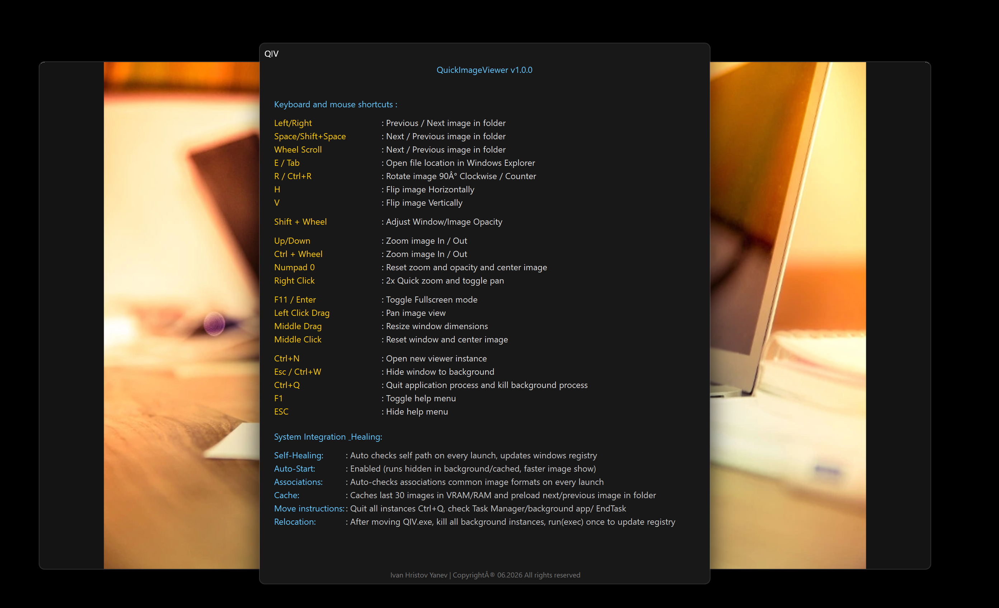

# 🖼️ QuickImageViewer (QIV)

*
*Looking
for
a
lightweight
WebP
viewer
for
Windows
that
doesn't
sacrifice
performance?
**

*
*QuickImageViewer (
QIV)
**
is
a
*
*fast
image
viewer
built
with
C++
**
and
native
Win32
APIs,
designed
for
users
who
demand
speed
and
direct
control.
Whether
you
need
a
*
*portable
image
viewer
with
no
install
**
required,
or
simply
want
to
escape
the
bloat
of
modern
software,
QIV
provides
a
seamless
experience
for
modern
formats
like
WebP,
JPEG
XL,
and
JPEG.

It
delivers
90%+
feature
parity
with
legacy
viewers
at
a
fraction
of
the
footprint (
178
KB).

---

## 📸 Preview

| Main Interface                     | Shortcuts & Integration                |
|:-----------------------------------|:---------------------------------------|
|  |  |

---

## 🚀 Download

You
can
download
the
latest
version
of
the
viewer
from
the
*
*[Releases page](https://github.com/icyhoty2k/PosMan/releases/latest)
**.

>
*Built
with
native
C++
for
maximum
efficiency (
178
KB).*

---

## ✨ Features

*
*
*⚡
Extreme
Efficiency:
**
178
KB
footprint
with
near-instant
startup.
*
*
*🧳
Portable:
**
Fully
self-contained;
runs
perfectly
from
any
folder
or
USB
drive
with
no
installation
required.
*
*
*👻
Service-Like
Persistence:
**
Stays
resident
in
RAM
and "
ghosts"
into
the
background (
Esc
to
hide),
ready
for
instant
recall.
*
*
*🩹
Self-Healing:
**
Automatically
manages
its
own
registry
paths
and
file
associations—just
run
it
once
after
moving
to
any
location.
*
*
*🛠️
Zero-Magic
Design:
**
Native
WIC-based
decoding,
explicit
state
management,
and
direct
Windows
API
calls
for
maximum
transparency
and
speed.
*
*
*🧠
Smart
Resource
Management:
**
Caches
images
in
VRAM
and
preloads
neighbors
for
a
stutter-free
browsing
experience.

---

## 📖 Installation & Usage

Simply
download
the
latest
binary
from
the
*
*[Releases page](https://github.com/icyhoty2k/PosMan/releases/latest)
**.

*
*💡
Note:
**
If
you
move
the
executable
to
a
new
folder,
run
it
once.
The
application
will
automatically
detect
the
path
change,
self-heal
the
registry
settings,
and
restore
file
associations.

---

## 🏗️ Architecture

Designed
for
developers
who
value
imperative,
explicit
code
over
declarative
abstractions:

*
*
*
`main.cpp`
** :
Application
lifecycle
and
instance
management.
*
*
*
`WicDecoder.cpp`
** :
Low-level
WIC
image
decoding.
*
*
*
`RendererD2D/GDI.cpp`
** :
Hardware-accelerated (
Direct2D)
or
fallback (
GDI)
rendering.
*
*
*
`AppState.h`
** :
Centralized,
queryable
system
state.

---

## ⚙️ Build

Requires [CMake](https://cmake.org/)
and
an [MSVC](https://visualstudio.microsoft.com/)
compiler.

```bash
git clone [https://github.com/icyhoty2k/QuickImageViewer.git](https://github.com/icyhoty2k/QuickImageViewer.git)
cd QuickImageViewer
mkdir build && cd build
cmake ..
cmake --build . --config Release
```

## 📜 License

Licensed
under
the
*
*[GNU Affero General Public License v3.0 (AGPLv3)](LICENSE)
**.
See
the [LICENSE](LICENSE)
file
for
full
details.
